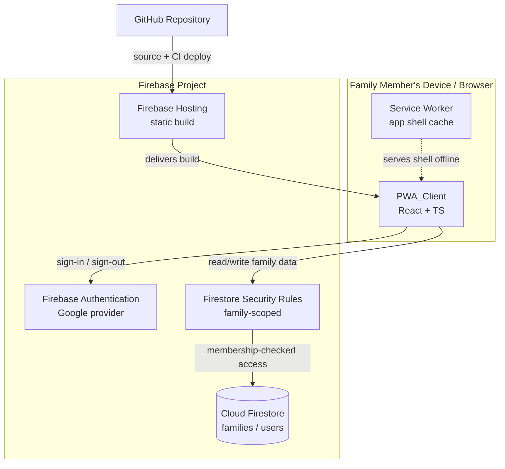
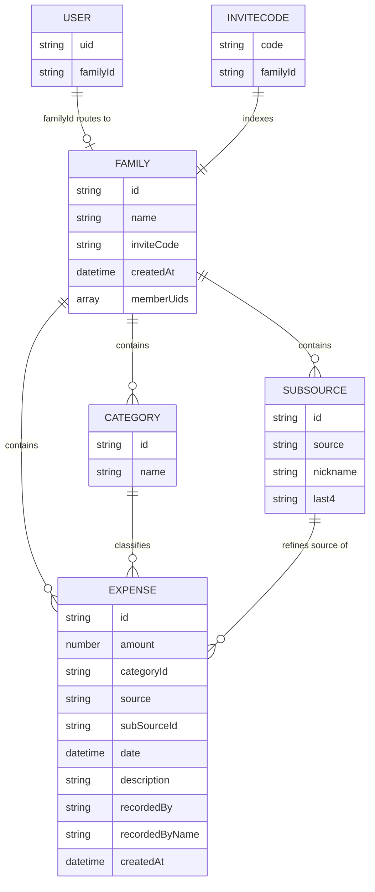

# Design Document

## Overview

The Family Expense Tracker is a Progressive Web App (PWA) built as a static client-side application backed by Firebase managed services. There is no custom server tier: the PWA_Client talks directly to Firebase Authentication (Google sign-in) and Cloud Firestore, with Firestore Security Rules enforcing access control on the server side. The app is deployed to Firebase Hosting via the Firebase CLI and its source is hosted on GitHub.

The MVP delivered authentication, expense entry, expense listing, a basic visualization dashboard, PWA installability/offline shell, access control, and a reproducible setup/deploy process against a single shared top-level `expenses` collection.

This revision designs the **expansion** of that MVP. It keeps the thin serverless architecture, the four-layer client structure, the pure-domain testing approach, and the Firebase technology choices, while adding:

- **Family groups joined by invite code** — every Expense, Category, and SubSource now belongs to exactly one Family, and members read/write only their own Family's data.
- **Family-scoped custom categories** — categories become editable data seeded per Family rather than a fixed client-side enum.
- **Payment sub-sources** — optional, user-defined refinements of a Source storing only a nickname and an optional last-4-digits identifier (never a full card number).
- **Data migration** — first-family creation migrates existing top-level expenses into the new family-scoped structure, safely and idempotently.
- **Family-scoped security rules** — access is gated on the caller's family membership rather than only on being authenticated.

This revision is a behavioral and data-model expansion only. It intentionally **does not** introduce a visual redesign and **does not** change the technology stack: the app remains React + Vite + TypeScript + Firebase, with Recharts for the dashboard and the existing component styling approach. New screens reuse the established UI conventions of the MVP.

### Design Goals

- **Thin, serverless architecture.** Continue to lean on Firebase managed services; the expansion adds collections and rules, not a server tier.
- **Server-enforced, family-scoped security.** Firestore Security Rules remain the source of truth for access control. Family membership is the new authorization boundary; client UI gating is a usability layer only.
- **Pure, testable core logic.** Keep validation, aggregation, sorting, and mapping as pure functions. Add new pure logic — invite-code generation, last-4 validation, category-name normalization/uniqueness, sub-source validation, and migration mapping — so it can be unit- and property-tested independent of Firebase and the DOM.
- **Real-time by default.** Continue using Firestore real-time listeners, now scoped to the member's family, so the expense list and dashboard update without manual reloads.
- **Safe, idempotent migration.** Existing history must never be lost or duplicated; migration must be re-runnable without corrupting data.
- **No stack or visual churn.** The expansion adds modules within the existing four-layer structure and the existing tech stack; it does not restyle the app or add new build-time dependencies beyond what the data model requires.

### Key Technology Decisions

| Concern | Decision | Rationale |
|---|---|---|
| Framework | React + Vite | First-class PWA tooling (`vite-plugin-pwa`), fast builds, static bundle Firebase Hosting serves directly. Unchanged from MVP. |
| Language | TypeScript | Type safety on the expanded data model (Family, Category, SubSource) and the new validation/migration logic that property tests target. |
| Backend | Firebase (Auth + Firestore) | Required by the spec; family scoping is modeled with Firestore subcollections and security rules — still no custom backend. Unchanged. |
| Styling | Existing MVP approach | No new styling system is introduced. New screens reuse the existing component styling conventions. Tailwind/Material Symbols are explicitly **out of scope**. |
| Charts | Recharts | Retained unchanged for the dashboard visualizations. |
| Service worker / manifest | `vite-plugin-pwa` (Workbox) | Generates the manifest and a precaching service worker for the app shell with minimal config. Unchanged. |
| Property testing | fast-check | De-facto property-based testing library for the TS/JS ecosystem; used for the expanded pure-logic surface. Already a dev dependency. |
| Unit testing | Vitest | Native to the Vite toolchain; runs the same TS config as the app. Unchanged. |

> Research note: `vite-plugin-pwa` wraps Workbox to generate a Web App Manifest and a precaching service worker, and exposes registration lifecycle hooks (`onRegistered`, `onRegisterError`) that map to Requirement 8's registration and failure-handling criteria. Firestore subcollections (`families/{familyId}/expenses/...`) let security rules authorize by reading a sibling document (`get(/databases/$(db)/documents/users/$(uid)).data.familyId`), which is the mechanism behind Requirement 9's family-scoped access. Firestore `onSnapshot` real-time listeners satisfy the live-update criteria in Requirements 3, 6, and 7. The expansion is implemented entirely within the existing React + Vite + TypeScript + Firebase stack and adds no new runtime dependencies.

## Architecture

### System Context



### Application Layers

The PWA_Client keeps its four layers so that core logic stays free of framework and I/O concerns. The expansion adds repositories, providers, hooks, domain modules, and screens (new items in **bold**):


- **UI Layer** renders screens and forwards user intents; no business rules beyond presentation. New screens cover create/join family, family settings/members, and category/sub-source management. Existing screens are extended in place (no restyle).
- **State/Hooks Layer** mediates between UI and data. The new `FamilyProvider`/`useFamily` resolves the current member's family and membership status; `useExpenses`, `useCategories`, and `useSubSources` are all scoped to the active family.
- **Domain Layer** is pure TypeScript: validation, aggregation, sorting, mapping, plus new invite-code, category, sub-source, and migration logic. This is the property-tested core.
- **Data Layer** wraps the Firebase SDK and is the only layer that imports it. `expenseRepository` becomes family-scoped, and three new repositories are added.

### Routing and Session/Family Gating

The client uses a single-page route table with two guarded boundaries — authentication and family membership:

- `/signin` — public, renders `SignIn`.
- `/family` — authenticated but **family-less** landing; renders `CreateJoinFamily` (Req 1.11, 2.1, 2.7).
- `/` (Dashboard), `/expenses` (list), `/add` (entry), `/settings` (family + categories + sub-sources) — require both an active Session **and** family membership.

`RequireAuth` checks the Session; if absent it redirects to `/signin` (Req 1.7). A new `RequireFamily` wrapper checks `useFamily().status`; an authenticated member with no family is routed to `/family` (Req 1.11, 2.7). Firebase Hosting keeps the SPA rewrite so deep links resolve to `index.html`.

The idle-timeout timer (Req 1.10) and auth-flow timeout (Req 1.8) remain in the state layer and trigger sign-out + redirect.


## Components and Interfaces

### Data Layer

**authService.ts** — wraps Firebase Authentication. Unchanged from the MVP except that a successful sign-in no longer implies access to data; family resolution happens separately.

```typescript
interface AuthService {
  signInWithGoogle(): Promise<FamilyMember>;
  signOut(): Promise<void>;
  onAuthChanged(listener: (member: FamilyMember | null) => void): Unsubscribe;
  getCurrentMember(): FamilyMember | null;
}
```

**familyRepository.ts** (new) — wraps Firestore access for families, membership, and the user→family routing document.

```typescript
interface FamilyRepository {
  // Creates a family with a generated unique invite code, seeds default
  // categories, adds the creator to memberUids, sets users/{uid}.familyId,
  // and (first family only) triggers migration of legacy expenses.
  createFamily(creator: FamilyMember, name?: string): Promise<Family>; // Req 2.2, 4.1, 10.1

  // Resolves a family by invite code and joins the caller. Rejects with an
  // InvalidInviteCode error when no family matches (Req 2.4).
  joinFamilyByInviteCode(code: string, member: FamilyMember): Promise<Family>; // Req 2.3, 2.4

  // Returns the caller's family via users/{uid}.familyId, or null when none.
  getFamilyForMember(uid: string): Promise<Family | null>; // Req 1.11, 2.5

  // Lists the members of a family for the settings/members screen.
  listMembers(familyId: string): Promise<FamilyMember[]>; // Req 2.6
}
```

**categoryRepository.ts** (new) — wraps the family's `categories` subcollection.

```typescript
interface CategoryRepository {
  subscribeToCategories(
    familyId: string,
    onData: (categories: Category[]) => void,
    onError: (error: Error) => void
  ): Unsubscribe;                                              // Req 4.2, 4.6
  addCategory(familyId: string, name: string): Promise<string>; // Req 4.3 (returns id)
  seedDefaults(familyId: string): Promise<void>;               // Req 4.1
}
```

**subSourceRepository.ts** (new) — wraps the family's `subSources` subcollection.

```typescript
interface SubSourceRepository {
  subscribeToSubSources(
    familyId: string,
    onData: (subSources: SubSource[]) => void,
    onError: (error: Error) => void
  ): Unsubscribe;                                              // Req 3.7, 5.x
  addSubSource(familyId: string, input: SubSourceInput): Promise<string>; // Req 5.2
}
```

**expenseRepository.ts** (revised) — now family-scoped; all reads/writes target `families/{familyId}/expenses`.

```typescript
interface ExpenseRepository {
  addExpense(familyId: string, input: ExpenseInput, member: FamilyMember): Promise<string>; // Req 3.2, 3.3
  subscribeToExpenses(
    familyId: string,
    onData: (expenses: Expense[]) => void,
    onError: (error: Error) => void
  ): Unsubscribe;                                              // Req 6.1, 6.4, 6.5
}
```

### State / Hooks Layer

**AuthProvider** — unchanged responsibilities: exposes `{ member, status, signIn, signOut }`, owns the idle/auth-flow timers, and clears in-memory data on Session termination (Req 9.4).

**FamilyProvider / useFamily** (new) — resolves the current member's family after authentication and exposes:

```typescript
interface UseFamilyResult {
  family: Family | null;
  members: FamilyMember[];
  status: 'loading' | 'no-family' | 'ready' | 'error';
  createFamily(name?: string): Promise<void>;          // Req 2.2
  joinFamily(inviteCode: string): Promise<void>;        // Req 2.3 (rejects on invalid, Req 2.4)
}
```

`status === 'no-family'` drives the `RequireFamily` redirect to `/family` (Req 1.11, 2.7).

**useExpenses** (revised) — subscribes via `ExpenseRepository.subscribeToExpenses(family.id, ...)` while a Session and family are active.

```typescript
interface UseExpensesResult {
  expenses: Expense[];        // already sorted date desc
  status: 'loading' | 'ready' | 'error';
  retry(): void;              // re-attempts subscription (Req 6.9)
}
```

**useCategories** (new) — subscribes to the family's categories and exposes add with client-side validation feedback:

```typescript
interface UseCategoriesResult {
  categories: Category[];
  status: 'loading' | 'ready' | 'error';
  addCategory(name: string): Promise<Result<Category, CategoryError>>; // Req 4.3, 4.4, 4.5
}
```

**useSubSources** (new) — subscribes to the family's sub-sources and exposes add with validation feedback:

```typescript
interface UseSubSourcesResult {
  subSources: SubSource[];
  status: 'loading' | 'ready' | 'error';
  addSubSource(input: SubSourceInput): Promise<Result<SubSource, SubSourceError>>; // Req 5.2, 5.3, 5.5
  forSource(source: Source): SubSource[]; // Req 3.7, 5.7
}
```

### Domain Layer (pure functions)

**validation.ts** (retained)

```typescript
function validateAmount(raw: string): Result<number, AmountError>;     // Req 3.2, 3.4
function validateDate(raw: string | null, today: Date): Result<Date, DateError>; // Req 3.9, 3.10
function validateDescription(raw: string): Result<string, DescError>;  // Req 3.1 (0..280)
function validateExpenseForm(form: ExpenseFormInput, today: Date): Result<ExpenseInput, FieldErrors>; // Req 3.5, 3.6
```

**inviteCode.ts** (new)

```typescript
// Generates an invite code from an injected randomness source. Codes use an
// unambiguous uppercase alphabet (no 0/O/1/I) and a fixed length.
function generateInviteCode(rng: () => number): string;                // Req 2.2
function isWellFormedInviteCode(code: string): boolean;                 // Req 2.4 (format gate)
function normalizeInviteCode(raw: string): string;                      // trims + uppercases for lookup
```

**category.ts** (new)

```typescript
// Canonical form used for uniqueness comparison (trim + collapse whitespace + casefold).
function normalizeCategoryName(raw: string): string;                    // Req 4.3, 4.5
// Validates a proposed name against existing names within the family.
function validateNewCategory(raw: string, existing: Category[]): Result<string, CategoryError>; // Req 4.4, 4.5
const DEFAULT_CATEGORY_SET: readonly string[];                          // Req 4.1
```

**subSource.ts** (new)

```typescript
// Accepts only exactly 4 numeric digits; returns the 4 digits or an error.
function validateLast4(raw: string | null): Result<string | null, Last4Error>; // Req 5.4, 5.5
// Validates nickname (non-empty) + optional last4; never accepts a full card number.
function validateSubSource(input: SubSourceFormInput): Result<SubSourceInput, SubSourceError>; // Req 5.2, 5.3, 5.6
```

**migration.ts** (new)

```typescript
// Maps a legacy top-level expense doc to a family-scoped expense, resolving its
// category string to a family Category (creating one when absent) and preserving
// amount/date/description/recordedBy/createdAt. Pure: returns the planned writes.
function planMigration(
  legacy: LegacyExpenseDocument[],
  existingCategories: Category[]
): MigrationPlan;                                                       // Req 10.2, 10.3, 10.4
// A plan is idempotent: re-running over already-migrated input is a no-op.
function isExpenseMigrated(legacyId: string, migrated: Set<string>): boolean; // Req 10.1 idempotence
```

**aggregation.ts** (retained)

```typescript
function totalAmount(expenses: Expense[]): number;                 // Req 7.1
function groupByCategory(expenses: Expense[]): GroupTotal[];        // Req 7.2
function groupBySource(expenses: Expense[]): GroupTotal[];          // Req 7.3
function groupByMonth(expenses: Expense[]): GroupTotal[];           // Req 7.4 (YYYY-MM keys)
```

**sorting.ts** (retained)

```typescript
function sortByDateDesc(expenses: Expense[]): Expense[];            // Req 6.4
```

**expenseMapper.ts** (revised — adds category/subSource references)

```typescript
function toFirestore(input: ExpenseInput, member: FamilyMember): ExpenseDocument; // Req 3.3
function fromFirestore(id: string, doc: ExpenseDocument): Expense;                // Req 6.2
// Resolves a stored categoryId/subSourceId to display labels for a row.
function resolveLabels(exp: Expense, cats: Category[], subs: SubSource[]): ExpenseRow; // Req 6.2, 6.3
```

### UI Layer

All components reuse the existing MVP styling conventions; no restyle or design-system change is introduced. The MVP screens persist; new screens are added.

| Component | Responsibility | Requirements |
|---|---|---|
| `SignIn` | Google sign-in button, error/timeout messages, signed-out landing | 1.1, 1.2, 1.4, 1.8, 1.9 |
| `AppShell` | Existing nav/header extended with a Family/Settings entry plus the family/member label and sign-out; offline banner | 1.5, 1.6, 8.6, 8.7 |
| `CreateJoinFamily` (new) | Create-new-family action and join-by-invite-code form with invalid-code messaging | 2.1, 2.2, 2.3, 2.4 |
| `FamilySettings` (new) | Lists family members, displays the family's invite code for sharing | 2.6 |
| `CategoryManager` (new) | Lists family categories; add-category form with empty/duplicate validation | 4.2, 4.3, 4.4, 4.5 |
| `SubSourceManager` (new) | Lists sub-sources by source; add form with nickname + optional last-4 validation | 5.1, 5.2, 5.3, 5.5 |
| `ExpenseEntryForm` (revised) | Amount/category(**family categories**)/source/**sub-source**/date/description fields, inline validation, confirmation, save-error retention | 3.1–3.12 |
| `ExpenseList` (revised) | Rows showing category name + recording member, per-row fields, empty state, loading indicator, error + retry | 6.1–6.9 |
| `Dashboard` (revised) | Total "Family Spend" plus Recharts category/source/month charts, empty state, error + retry | 7.1–7.7 |
| `InstallPrompt` | Surfaces install affordance when `beforeinstallprompt` fires | 8.4 |

`Source` remains a fixed enumeration (Cash, Credit Card, Reward Points, Food Coupon, Cashback Points). Categories and sub-sources are now family-scoped data offered as selectable options in `ExpenseEntryForm` (Req 4.6, 3.7).

## Data Models

### Family-scoped domain models

```typescript
// A family group. Members share all expense/category/sub-source data.
interface Family {
  id: string;
  name: string | null;
  inviteCode: string;     // unique, shareable (Req 2.2)
  createdAt: Date;
  memberUids: string[];   // members of this family (Req 2.5)
}

// Family-scoped, editable category (was a fixed enum in the MVP).
interface Category {
  id: string;
  name: string;           // unique within the family (normalized) (Req 4.3, 4.5)
}

// Fixed funding-method enum (unchanged).
type Source =
  | 'Cash' | 'Credit Card' | 'Reward Points'
  | 'Food Coupon' | 'Cashback Points';

// Optional, family-scoped refinement of a Source. Stores nickname + optional
// last4 ONLY — never a full card number (Req 5.6, 9.5).
interface SubSource {
  id: string;
  source: Source;         // the parent funding method
  nickname: string;       // required, non-empty (Req 5.2)
  last4?: string;         // exactly 4 digits when present (Req 5.4)
}

// Form input prior to validation.
interface SubSourceFormInput {
  source: Source;
  nickname: string;
  last4: string | null;   // raw user input; validated to 4 digits or rejected
}
type SubSourceInput = Omit<SubSource, 'id'>;

// Validated expense input ready to persist (no id/audit fields yet).
interface ExpenseInput {
  amount: number;         // 0.01 .. 999,999,999.99, <= 2 decimals (Req 3.2)
  categoryId: string;     // references a family Category (Req 3.2, 3.5)
  source: Source;         // required (Req 3.6)
  subSourceId?: string;   // optional reference to a SubSource (Req 3.8)
  date: Date;             // 2000-01-01 .. today (Req 3.2, 3.10)
  description: string;    // 0..280 chars (may be empty) (Req 3.1)
}

// Full client-side expense read back from the Data_Store.
interface Expense extends ExpenseInput {
  id: string;
  recordedBy: string;     // FamilyMember uid (Req 3.3)
  recordedByName: string; // denormalized display name for list rendering (Req 6.2)
  createdAt: Date;        // creation timestamp (Req 3.3)
}

// An authenticated user. familyId is resolved via the users/{uid} routing doc.
interface FamilyMember {
  uid: string;
  displayName: string | null;
  email: string | null;
}
```

The display label resolves as `displayName ?? email ?? 'Signed in'` (Req 1.5).

### Firestore representation

```typescript
interface ExpenseDocument {
  amount: number;            // integer-cents recommended internally (see note)
  categoryId: string;        // family Category id
  source: string;            // Source enum value
  subSourceId?: string;      // family SubSource id, when selected
  date: Timestamp;
  description: string;
  recordedBy: string;        // request.auth.uid
  recordedByName: string;    // denormalized for rendering
  createdAt: Timestamp;      // serverTimestamp()
}

interface FamilyDocument {
  name: string | null;
  inviteCode: string;
  createdAt: Timestamp;
  memberUids: string[];
}

interface CategoryDocument { name: string; }
interface SubSourceDocument { source: string; nickname: string; last4?: string; }
interface UserDocument { familyId: string; }       // routing + rules check
interface InviteCodeDocument { familyId: string; } // optional index doc (see below)
```

> Amount precision note (unchanged): amounts are validated against the 2-decimal rule at the boundary and aggregation is performed in integer cents internally, converting back to a 2-decimal number for display, keeping `totalAmount` exact for the value range in Req 3.2.

### Firestore Collection Layout (revised)

The MVP's single top-level `expenses` collection is replaced by family-scoped subcollections, plus a top-level `users` routing collection:

```
users/{uid}
  familyId                                  // routes the member + powers rules checks

families/{familyId}
  name?, inviteCode, createdAt, memberUids[]

families/{familyId}/expenses/{expenseId}
  amount, categoryId, source, subSourceId?, date,
  description, recordedBy, recordedByName, createdAt

families/{familyId}/categories/{categoryId}
  name

families/{familyId}/subSources/{subSourceId}
  source, nickname, last4?

inviteCodes/{code}                          // optional invite-code index (see decision)
  familyId
```



#### Decision: invite-code lookup

Joining by invite code (Req 2.3) requires mapping a code → familyId for an unauthenticated-to-the-family caller. Two options were considered:

1. **Query `families` by `inviteCode`.** Simple (one collection), but the joiner has no read access to arbitrary families under family-scoped rules, so a query would be denied — security rules cannot easily authorize "read the one family whose code you typed" without exposing the whole collection.
2. **`inviteCodes/{code}` → `{ familyId }` index document.** A dedicated top-level collection keyed by the code. A rule can allow an authenticated user to `get` a single invite-code doc by id (they must already know the exact code), revealing only the target `familyId` and nothing about other families. The join then writes `users/{uid}.familyId` and appends to `families/{familyId}.memberUids`.

**Chosen: option 2 (`inviteCodes/{code}` index).** It gives a precise, least-privilege lookup (get-by-known-id rather than collection query), keeps family documents unreadable to non-members, and makes uniqueness enforceable (the code is the document id, so creation fails on collision). The cost is one extra index document written at family creation, which is acceptable.

### GroupTotal (aggregation output, unchanged)

```typescript
interface GroupTotal {
  key: string;     // category name, source name, or "YYYY-MM"
  total: number;   // sum of amounts for the group (2-decimal)
}
```

### Migration model

```typescript
// Legacy MVP document shape (top-level `expenses`), category/source as strings.
interface LegacyExpenseDocument {
  id: string;
  amount: number;
  category: string;       // legacy string -> mapped to a family Category
  source: string;         // legacy string -> mapped to a Source
  date: Timestamp;
  description: string;
  recordedBy: string;
  createdAt: Timestamp;
}

// A pure, inspectable plan produced by migration.ts.
interface MigrationPlan {
  categoriesToCreate: { name: string }[];          // categories missing in the family (Req 10.2)
  expenseWrites: {
    legacyId: string;                              // used for idempotence keying (Req 10.1)
    familyExpense: ExpenseInput & { recordedBy: string; createdAt: Date };
  }[];                                             // amount/date/description/recordedBy/createdAt preserved (Req 10.4)
  failures: { legacyId: string; reason: string }[]; // unmappable expenses left unchanged (Req 10.5)
}
```

Migration runs once, when the **first** family is created (Req 10.1). The plan is pure and idempotent: each legacy expense is keyed by its original id, and re-running skips ids already present in the family's `expenses` (so a partial/retried migration never duplicates). Category strings map to existing family categories by normalized name, creating a Category when none matches (Req 10.2); source strings map to the fixed `Source` enum (Req 10.3); amount, date, description, `recordedBy`, and `createdAt` are copied unchanged (Req 10.4). An expense that cannot be mapped is recorded as a failure and its original document is left untouched (Req 10.5).

### Firestore Security Rules (model, revised)

Access is gated on the caller's family membership. The caller's family is read from `users/{uid}.familyId`; writes to family subcollections must target that family.

```
rules_version = '2';
service cloud.firestore {
  match /databases/{database}/documents {

    function callerFamily() {
      return get(/databases/$(database)/documents/users/$(request.auth.uid)).data.familyId;
    }
    function isMember(familyId) {
      return request.auth != null && callerFamily() == familyId;
    }

    // Routing doc: a user may read/write only their own routing document.
    match /users/{uid} {
      allow read, write: if request.auth != null && request.auth.uid == uid;
    }

    // Invite-code index: any authenticated user may look up a code they know
    // (get-by-id only — no listing), revealing only the target familyId.
    match /inviteCodes/{code} {
      allow get: if request.auth != null;
      allow list: if false;
      allow create: if request.auth != null;   // written at family creation
      allow update, delete: if false;
    }

    // Family document: members may read; creation must include the creator.
    match /families/{familyId} {
      allow read: if isMember(familyId);
      allow create: if request.auth != null
                    && request.auth.uid in request.resource.data.memberUids;
      // Joining appends the caller to memberUids (membership growth only).
      allow update: if request.auth != null
                    && request.auth.uid in request.resource.data.memberUids;
      allow delete: if false;

      // All family-scoped data: members of THIS family only (Req 9.1, 9.2, 9.3).
      match /expenses/{expenseId} {
        allow read: if isMember(familyId);
        allow create: if isMember(familyId)
                      && request.resource.data.recordedBy == request.auth.uid;
        allow update, delete: if false;        // editing/deleting out of scope
      }
      match /categories/{categoryId} {
        allow read: if isMember(familyId);
        allow create: if isMember(familyId);
        allow update, delete: if false;        // only adding is in scope
      }
      match /subSources/{subSourceId} {
        allow read: if isMember(familyId);
        // No-full-card-number guarantee: reject any payload with extra fields;
        // only source, nickname, and an optional 4-digit last4 are allowed.
        allow create: if isMember(familyId)
                      && request.resource.data.keys().hasOnly(['source','nickname','last4'])
                      && request.resource.data.nickname is string
                      && (!('last4' in request.resource.data)
                          || request.resource.data.last4.matches('^[0-9]{4}$'));
        allow update, delete: if false;        // only adding is in scope
      }
    }
  }
}
```

This enforces Requirement 9: requests from non-members are denied for both reads and writes (9.1, 9.2); members are granted access only to their own family's records (9.3); and the sub-source create rule structurally guarantees no full card number is ever stored (9.5, 5.6) by allowlisting fields and constraining `last4` to exactly four digits.

## Correctness Properties

*A property is a characteristic or behavior that should hold true across all valid executions of a system — essentially, a formal statement about what the system should do. Properties serve as the bridge between human-readable specifications and machine-verifiable correctness guarantees.*

The expansion keeps the MVP's pure-logic core (validation, mapping, sorting, aggregation) and adds new pure logic (invite-code generation, last-4 validation, category-name normalization/uniqueness, sub-source validation, migration mapping). All of this is amenable to property-based testing with fast-check. Properties 1–8 are **retained from the MVP** (with requirement clauses renumbered to this document's requirements); Properties 9–13 are **new** for the expansion.

Cross-family access isolation (Requirement 9.1–9.3) is intentionally **not** expressed as a property-based test: it is enforced by Firestore Security Rules (external behavior that does not vary meaningfully with input) and is verified with emulator-based rules tests instead (see Testing Strategy).

### Property 1: Signed-in label resolution

*For any* FamilyMember, `resolveMemberLabel` SHALL return the display name when present, otherwise the email when present, otherwise the literal `"Signed in"`, treating empty or whitespace-only values as absent.

**Validates: Requirements 1.5**

### Property 2: Amount validation accepts valid and rejects invalid amounts

*For any* amount string, `validateAmount` SHALL accept it if and only if it is numeric, greater than or equal to 0.01, less than or equal to 999,999,999.99, and has at most 2 decimal places, and SHALL reject all other inputs with a field error.

**Validates: Requirements 3.2, 3.4**

### Property 3: Date validation defaults empty and rejects out-of-range dates

*For any* "current date" value, `validateDate` SHALL resolve an empty date input to the current date, SHALL accept any valid calendar date in the range 2000-01-01 through the current date, and SHALL reject any non-calendar date, any date earlier than 2000-01-01, and any date later than the current date.

**Validates: Requirements 3.9, 3.10**

### Property 4: Expense mapping round-trips and attributes the submitter

*For any* valid ExpenseInput and FamilyMember, mapping the input to a Firestore document and back SHALL preserve the user-entered fields (amount, categoryId, source, subSourceId when present, date, description), and the Firestore document SHALL always include `recordedBy` equal to the member's uid and a creation timestamp.

**Validates: Requirements 3.3**

### Property 5: Expense list ordering

*For any* collection of Expenses, `sortByDateDesc` SHALL return a permutation of the input ordered by Expense date from most recent to least recent.

**Validates: Requirements 6.4**

### Property 6: Rendered expense row completeness

*For any* Expense, its rendered list row SHALL contain the monetary amount, the Category name, the Source name, and the Expense date; the SubSource nickname SHALL be shown when the Expense references a SubSource; the description SHALL be shown when present and SHALL be blank when the description is empty.

**Validates: Requirements 6.2, 6.3**

### Property 7: Grand total equals the sum of amounts

*For any* collection of Expenses, `totalAmount` SHALL equal the exact sum of the amounts of all Expenses in the collection (computed in integer cents), and SHALL equal 0 for an empty collection.

**Validates: Requirements 7.1**

### Property 8: Grouping partitions the data

*For any* collection of Expenses and any grouping dimension (Category, Source, or calendar month), the produced groups SHALL have exactly one entry per distinct value present in the collection, and the sum of all group totals SHALL equal the grand total of the collection.

**Validates: Requirements 7.2, 7.3, 7.4**

### Property 9: Invite-code generation is well-formed and self-normalizing

*For any* sequence of values produced by the injected randomness source, `generateInviteCode` SHALL produce a code whose length is within the documented bound (6–8 characters) and whose every character is drawn from the unambiguous uppercase base32 alphabet (excluding the ambiguous characters `0`, `O`, `1`, and `I`); and for any such generated code, `isWellFormedInviteCode` SHALL return true and `normalizeInviteCode` SHALL return the code unchanged (the generator output is already normalized).

**Validates: Requirements 2.2, 2.4**

### Property 10: Last-4 validation accepts exactly four digits and rejects everything else

*For any* string, `validateLast4` SHALL accept it and return exactly those four characters if and only if the input consists of exactly four ASCII digits (`0`–`9`); an absent input (null or empty) SHALL be accepted as "no identifier"; and every other input — wrong length, non-digit characters, surrounding whitespace, or non-ASCII digits — SHALL be rejected.

**Validates: Requirements 5.4, 5.5**

### Property 11: Sub-source validation requires a nickname and never stores a card number

*For any* SubSource form input, `validateSubSource` SHALL succeed if and only if the nickname is non-empty after trimming and the optional last-4 identifier passes `validateLast4`; and whenever it succeeds, the produced value SHALL contain only the fields `source`, `nickname`, and (optionally) a `last4` of exactly four digits — never any additional field and never a full card number.

**Validates: Requirements 5.2, 5.3, 5.6, 9.5**

### Property 12: Category-name validation enforces non-empty, case-insensitive uniqueness

*For any* list of existing Categories and any candidate name, `validateNewCategory` SHALL accept the candidate if and only if its normalized form (trimmed, whitespace-collapsed, case-folded) is non-empty and does not equal the normalized form of any existing Category name; it SHALL reject empty or whitespace-only names and SHALL reject any name that duplicates an existing one regardless of letter casing or surrounding whitespace.

**Validates: Requirements 4.3, 4.4, 4.5**

### Property 13: Migration preserves every field, maps every category, and is idempotent

*For any* set of legacy expenses, any set of existing family Categories, and any set of already-migrated legacy ids, `planMigration` SHALL: (a) for every successfully mapped legacy expense, preserve its amount, date, description, recordedBy, and createdAt unchanged and assign a `categoryId` for its category string and a `source` for its source string; (b) include in `categoriesToCreate` exactly the distinct legacy category strings that have no case-insensitive match among existing Categories, so that every distinct category string resolves to a category; (c) record any legacy expense that cannot be mapped in `failures` keyed by its legacy id and produce no write for it; and (d) produce no expense write for any legacy id present in the already-migrated set, so re-running the plan never duplicates data.

**Validates: Requirements 10.1, 10.2, 10.3, 10.4, 10.5**

## Error Handling

Errors are classified by source and handled at the layer closest to the cause, surfacing a user-facing message without losing user input or previously loaded data. The expansion adds family, category, sub-source, and migration error paths to the MVP set.

### Authentication errors

| Condition | Handling | Requirement |
|---|---|---|
| Google auth fails | Show sign-in error; remain on sign-in; no Session | 1.4 |
| Auth flow exceeds 60s | Cancel pending flow; show timeout error; return to sign-in; no Session | 1.8 |
| User cancels flow | Return to sign-in silently (no error) | 1.9 |
| Idle for 60 min | End Session; redirect to sign-in | 1.10 |

The state layer distinguishes "cancel" (no error UI) from "failure" (error UI) by inspecting the rejection reason from the Firebase Auth SDK.

### Family membership errors

| Condition | Handling | Requirement |
|---|---|---|
| Authenticated member belongs to no family | `RequireFamily` routes to `/family` (create-or-join); app screens are not shown | 1.11, 2.7 |
| Invite code does not match any family | `joinFamily` rejects with `InvalidInviteCode`; `CreateJoinFamily` shows an "invalid code" message and joins nothing | 2.4 |
| Invite-code collision at family creation | `createFamily` retries code generation a bounded number of times inside the transaction; the create succeeds with a unique code or surfaces a creation error | 2.2 |
| Family resolution read fails | `useFamily` exposes `status: 'error'`; the UI shows a load error and offers retry | 9.1 |

Joining is performed as a transaction: the `inviteCodes/{code}` index document is read by id to resolve `familyId`, then `users/{uid}.familyId` is set and the caller's uid is appended to `families/{familyId}.memberUids`. A non-existent code yields no index document and is reported as invalid (Req 2.4).

### Category and sub-source errors

- Category add validation is performed by `validateNewCategory` before any write: empty/whitespace-only names show a "name required" message (Req 4.4) and case-insensitive duplicates show an "already exists" message (Req 4.5); no document is written in either case.
- Sub-source add validation is performed by `validateSubSource`/`validateLast4` before any write: a missing nickname shows a "nickname required" message (Req 5.3) and a last-4 value that is not exactly four digits shows a "must be exactly 4 digits" message (Req 5.5); no document is written. The security rule independently allowlists fields so a full card number can never be stored (Req 5.6, 9.5).

### Expense write errors

- On `addExpense` rejection or no completion within 10 seconds, `ExpenseEntryForm` shows a save-failed error and **retains all entered field values** so the member can retry (Req 3.12). The 10-second ceiling is enforced with a timeout wrapper around the repository call.
- Validation failures are handled before any write: per-field messages are shown and no write is attempted (Req 3.4, 3.5, 3.6, 3.10).

### Expense read errors

- `useExpenses` exposes an `error` status on listener failure. `ExpenseList` and `Dashboard` show an error message, **retain previously displayed data**, and render a retry control that re-subscribes (Req 6.8, 6.9, 7.7).

### Migration errors

- Migration runs once at first-family creation and is driven by the pure, inspectable `MigrationPlan`. Each legacy expense is keyed by its original id; a partial or retried migration skips ids already present in the family's `expenses`, so it never duplicates (Req 10.1).
- An expense that cannot be mapped is recorded in `failures` (by legacy id and reason); its original top-level document is left **unchanged**, and the UI surfaces which expense failed (Req 10.5). A migration failure for one expense does not abort migration of the others.

### PWA / connectivity errors

- Service-worker registration failure is caught in the `vite-plugin-pwa` `onRegisterError` hook: the app continues from the network and shows an "offline capabilities unavailable" message (Req 8.3).
- Offline state (via the `offline`/`online` events) shows a "data requires a network connection" banner over the cached shell, removed on reconnect with a data reload (Req 8.6, 8.7).

### Security / access errors

- Firestore permission-denied responses are enforced by Security Rules for non-members and unauthenticated callers (Req 9.1, 9.2, 9.3). The client treats permission-denied on read as a load error, clears in-memory family data on Session termination within 1 second (Req 9.4), and routes unauthenticated users to sign-in.

### Deployment errors

- Firebase Hosting releases are atomic: a failed `firebase deploy` leaves the prior release serving and prints the failure reason to the CLI (Req 11.3).

## Testing Strategy

The expansion keeps the MVP's layered testing approach. Pure domain logic is covered by property-based tests (the bulk of correctness assurance) plus targeted unit tests for specific examples and edge cases. Firebase-dependent behavior — including the new family scoping and cross-family isolation — is covered by mock-based unit tests and Firestore emulator integration/rules tests. Configuration is covered by smoke checks.

### Tooling

- **Vitest** as the test runner (shares the Vite/TS config). Unchanged.
- **fast-check** for property-based tests. Property-based testing is **not** implemented from scratch; it is already a dev dependency.
- **@testing-library/react** for component rendering tests.
- **Firebase Local Emulator Suite** for Firestore Security Rules and family-scoped repository tests.

### Property-based tests

- Each correctness property (1–13) is implemented as a **single** property-based test.
- Each property test runs a **minimum of 100 iterations**.
- Each property test is tagged with a comment referencing its design property in the format:
  `// Feature: family-expense-tracker-pwa, Property {number}: {property_text}`
- Generators:
  - **Amounts / dates / descriptions / members:** retained from the MVP (valid + invalid amount arbitraries; in-range/boundary/out-of-range/invalid dates with an injected "today"; descriptions including empty and the 280-char boundary; members covering all null/non-null displayName+email combinations).
  - **Invite codes (Property 9):** an arbitrary randomness source (sequence of numbers/bytes) feeding `generateInviteCode`; assertions on charset, length bound, and `normalize`/`isWellFormed` self-consistency.
  - **Last-4 (Property 10):** arbitrary strings — random ASCII, exactly-4-digit strings, wrong-length digit strings, digit strings with whitespace, and non-ASCII digit characters — to exercise both accept and reject branches.
  - **Sub-sources (Property 11):** arbitrary `source` (from the fixed `Source` enum), nicknames (including empty/whitespace), and last-4 inputs; assertions on accept/reject and on the validated output containing only `{source, nickname, last4?}`.
  - **Category names (Property 12):** an arbitrary list of existing category names plus a candidate name produced by case/whitespace mutations of existing names (to stress case-insensitive uniqueness) and fresh names.
  - **Migration (Property 13):** arbitrary legacy-expense sets (with category/source strings drawn from both known and novel values), arbitrary existing-category sets, and arbitrary already-migrated id sets; assertions on field preservation, category-id assignment + `categoriesToCreate` completeness, `failures` keying, and idempotence over the migrated-id set.

### Unit tests (examples and edge cases)

- Sign-in screen renders the Google option; sign-in click invokes the auth service (1.1, 1.2).
- Auth failure, cancel, timeout, idle-timeout behaviors with mocked auth service and **fake timers** (1.4, 1.8, 1.9, 1.10).
- Route guards: `RequireAuth` redirects unauthenticated access (1.7); `RequireFamily` routes a family-less member to `/family` (1.11, 2.7); state cleared on Session termination within 1s (9.4).
- `CreateJoinFamily` renders create + join affordances for a family-less member (2.1); invalid invite code shows the invalid message and joins nothing (2.4).
- `FamilySettings` renders the member list and the family's invite code (2.6).
- `CategoryManager`: missing-name and duplicate-name submissions are rejected with messages (4.4, 4.5); the entry form's category select offers the family's categories (4.6).
- `SubSourceManager`: missing-nickname and bad-last-4 submissions rejected (5.3, 5.5); a source with no sub-sources lets an expense be recorded without one (5.7).
- Expense entry: missing-category, category-not-in-family, and missing-source submissions are rejected (3.5, 3.6); success confirmation + form clear (3.11); save-failure retains values (3.12); the optional sub-source select appears only when the chosen source has sub-sources (3.7).
- List empty state, loading indicator, read-error + retry (6.6, 6.7, 6.8, 6.9); a row shows the sub-source nickname when present (6.2).
- Dashboard empty state and read-error + retry (7.6, 7.7).
- Install affordance on `beforeinstallprompt`; SW-registration-failure fallback message (8.4, 8.3).

### Integration tests (Firestore emulator)

- Family-scoped repositories: `expenseRepository`, `categoryRepository`, and `subSourceRepository` read/write only under `families/{familyId}/...` and reflect new snapshots live (3.1, 3.7, 4.2, 6.1, 6.5, 7.5).
- `createFamily` writes the family document, the creator's `users/{uid}.familyId`, the `inviteCodes/{code}` index, and the seeded default categories; collision on the index id triggers a bounded retry (2.2, 4.1).
- `joinFamilyByInviteCode` resolves a known code via the index, appends the caller to `memberUids`, and sets the routing doc; a non-existent code is reported invalid (2.3, 2.4).
- One-time migration: first-family creation migrates legacy top-level expenses into `families/{id}/expenses`, creating categories from distinct strings and preserving fields; re-running is a no-op; an unmappable expense is left in place and reported (10.1–10.5).
- Session establishment/teardown against the Auth mock (1.3, 1.6).
- Connectivity transitions: offline banner and reconnect reload (8.6, 8.7).

### Security rules tests (emulator)

These are the primary verification for Requirement 9's cross-family isolation, which is deliberately not a property-based test:

- A member of family A **cannot** read or write family B's `expenses`, `categories`, or `subSources`; a member of A **can** read/write A's records (9.1, 9.2, 9.3).
- Unauthenticated read/write of any family subcollection is denied (9.1, 9.2).
- `users/{uid}` is readable/writable only by that uid; `inviteCodes/{code}` allows get-by-id but denies `list` (least-privilege lookup).
- A `subSources` create with an extra field, or with a `last4` that is not exactly four digits, is denied — structurally guaranteeing no full card number is stored (5.6, 9.5).
- Expense `update`/`delete` are denied for everyone (editing/deleting is out of scope); category and sub-source `update`/`delete` are denied (only adding is in scope).

### Smoke / configuration checks

- Generated manifest has name, icon sizes 192→512, and `display: standalone` (8.1).
- App shell is precached and renders (8.5).
- `firebase.json` / `.firebaserc` present with Hosting config (11.1); build produces a static `dist` (11.2).
- README contains ordered configure/run/deploy sections (11.4).
- `.gitignore` excludes Firebase credential and secret files; no secrets tracked (11.6).
