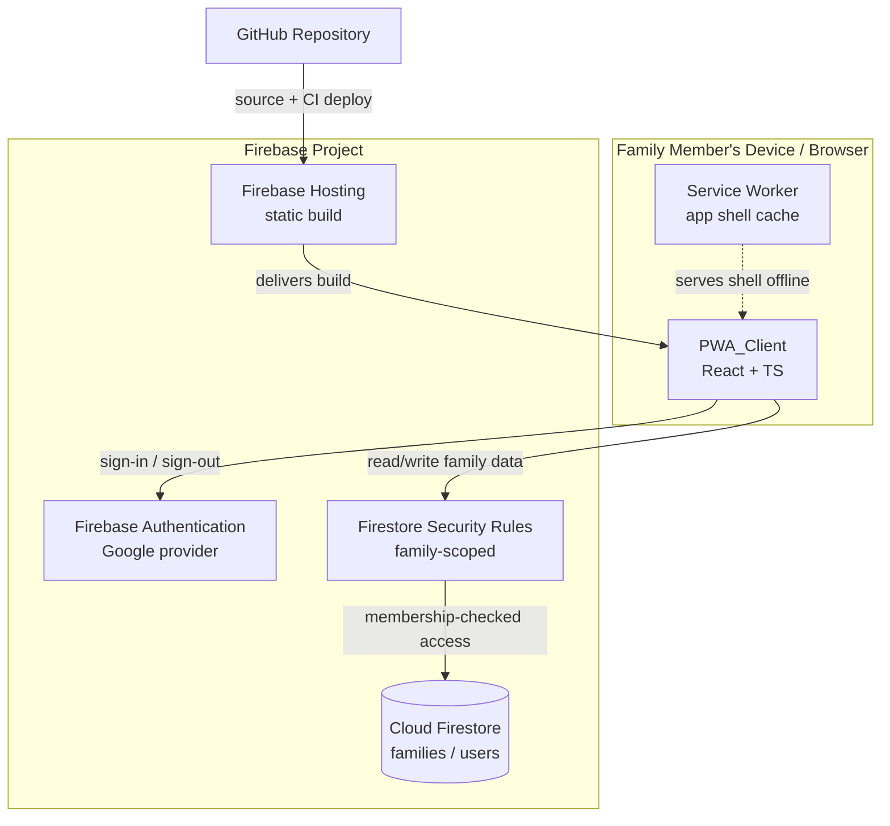
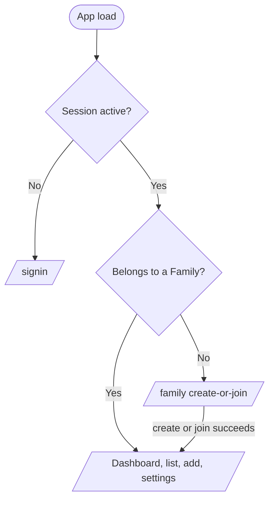
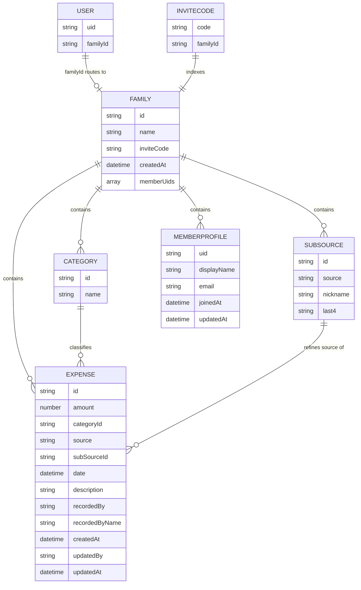

# Design Document

## Overview

The Family Expense Tracker is a Progressive Web App (PWA) built as a static client-side application backed by Firebase managed services. There is no custom server tier: the PWA_Client talks directly to Firebase Authentication (Google sign-in) and Cloud Firestore, with Firestore Security Rules enforcing access control on the server side. The app is deployed to Firebase Hosting via the Firebase CLI and its source is hosted on GitHub.

The MVP delivered authentication, expense entry, expense listing, a basic visualization dashboard, PWA installability/offline shell, access control, and a reproducible setup/deploy process against a single shared top-level `expenses` collection.

This revision designs the **expansion** of that MVP. It keeps the thin serverless architecture, the four-layer client structure, the pure-domain testing approach, and the Firebase technology choices, while adding:

- **Family groups joined by invite code** — every Expense, Category, and SubSource now belongs to exactly one Family, and members read/write only their own Family's data.
- **Family-scoped custom categories** — categories become editable data seeded per Family rather than a fixed client-side enum.
- **Payment sub-sources** — optional, user-defined refinements of a Source storing only a nickname and an optional last-4-digits identifier (never a full card number).
- **Data migration** — first-family creation migrates existing top-level expenses into the new family-scoped structure, safely and idempotently.
- **Family-scoped security rules** — access is gated on the caller's family membership rather than only on being authenticated.

This revision is further expanded with a second round of member-collaboration features layered on top of the structure above:

- **Member profiles** — a `members` subcollection under each family stores each member's display name and email so the member list shows readable names instead of bare uids, with existing members backfilled on sign-in.
- **Expense edit and delete** — any member of a family may edit or delete any expense in that family (not only the one they recorded), with edits preserving the original recorder/creation time and stamping an editor/update time.
- **Category and sub-source delete with in-use protection** — a member may delete a category or sub-source that no expense references; an attempt to delete one that is still referenced is blocked and reports how many expenses use it.
- **Relaxed, still family-scoped access control** — security rules now permit members to update and delete their own family's expenses (and delete categories/sub-sources), while preserving strict cross-family isolation.

This revision is a behavioral and data-model expansion only. It intentionally **does not** introduce a visual redesign and **does not** change the technology stack: the app remains React + Vite + TypeScript + Firebase, with Recharts for the dashboard and the established dark FamilyVault component styling. New and revised screens stay consistent with the existing dark UI; no new build-time dependencies are introduced.

### Design Goals

- **Thin, serverless architecture.** Continue to lean on Firebase managed services; the expansion adds collections and rules, not a server tier.
- **Server-enforced, family-scoped security.** Firestore Security Rules remain the source of truth for access control. Family membership is the new authorization boundary; client UI gating is a usability layer only.
- **Pure, testable core logic.** Keep validation, aggregation, sorting, and mapping as pure functions. Add new pure logic — invite-code generation, last-4 validation, category-name normalization/uniqueness, sub-source validation, and migration mapping — so it can be unit- and property-tested independent of Firebase and the DOM.
- **Real-time by default.** Continue using Firestore real-time listeners, now scoped to the member's family, so the expense list and dashboard update without manual reloads.
- **Safe, idempotent migration.** Existing history must never be lost or duplicated; migration must be re-runnable without corrupting data.
- **No stack or visual churn.** The expansion adds modules within the existing four-layer structure and the existing tech stack; it does not restyle the app or add new build-time dependencies beyond what the data model requires.

### Key Technology Decisions

| Concern | Decision | Rationale |
|---|---|---|
| Framework | React + Vite | First-class PWA tooling (`vite-plugin-pwa`), fast builds, static bundle Firebase Hosting serves directly. Unchanged from MVP. |
| Language | TypeScript | Type safety on the expanded data model (Family, Category, SubSource) and the new validation/migration logic that property tests target. |
| Backend | Firebase (Auth + Firestore) | Required by the spec; family scoping is modeled with Firestore subcollections and security rules — still no custom backend. Unchanged. |
| Styling | Existing MVP approach | No new styling system is introduced. New screens reuse the existing component styling conventions. Tailwind/Material Symbols are explicitly **out of scope**. |
| Charts | Recharts | Retained unchanged for the dashboard visualizations. |
| Service worker / manifest | `vite-plugin-pwa` (Workbox) | Generates the manifest and a precaching service worker for the app shell with minimal config. Unchanged. |
| Property testing | fast-check | De-facto property-based testing library for the TS/JS ecosystem; used for the expanded pure-logic surface. Already a dev dependency. |
| Unit testing | Vitest | Native to the Vite toolchain; runs the same TS config as the app. Unchanged. |

> Research note: `vite-plugin-pwa` wraps Workbox to generate a Web App Manifest and a precaching service worker, and exposes registration lifecycle hooks (`onRegistered`, `onRegisterError`) that map to Requirement 8's registration and failure-handling criteria. Firestore subcollections (`families/{familyId}/expenses/...`) let security rules authorize by reading a sibling document (`get(/databases/$(db)/documents/users/$(uid)).data.familyId`), which is the mechanism behind Requirement 9's family-scoped access. Firestore `onSnapshot` real-time listeners satisfy the live-update criteria in Requirements 3, 6, and 7. The expansion is implemented entirely within the existing React + Vite + TypeScript + Firebase stack and adds no new runtime dependencies.

## Architecture

### System Context



### Application Layers

The PWA_Client keeps its four layers so that core logic stays free of framework and I/O concerns. The expansion adds repositories, providers, hooks, domain modules, and screens (new items in **bold**):


- **UI Layer** renders screens and forwards user intents; no business rules beyond presentation. New screens cover create/join family, family settings/members, and category/sub-source management. Existing screens are extended in place (no restyle).
- **State/Hooks Layer** mediates between UI and data. The new `FamilyProvider`/`useFamily` resolves the current member's family and membership status; `useExpenses`, `useCategories`, and `useSubSources` are all scoped to the active family.
- **Domain Layer** is pure TypeScript: validation, aggregation, sorting, mapping, plus new invite-code, category, sub-source, and migration logic. This is the property-tested core.
- **Data Layer** wraps the Firebase SDK and is the only layer that imports it. `expenseRepository` becomes family-scoped, and three new repositories are added.

### Routing and Session/Family Gating

The client uses a single-page route table with two guarded boundaries — authentication and family membership:

- `/signin` — public, renders `SignIn`.
- `/family` — authenticated but **family-less** landing; renders `CreateJoinFamily` (Req 1.11, 2.1, 2.7).
- `/` (Dashboard), `/expenses` (list), `/add` (entry), `/settings` (family + categories + sub-sources) — require both an active Session **and** family membership.

`RequireAuth` checks the Session; if absent it redirects to `/signin` (Req 1.7). A new `RequireFamily` wrapper checks `useFamily().status`; an authenticated member with no family is routed to `/family` (Req 1.11, 2.7). Firebase Hosting keeps the SPA rewrite so deep links resolve to `index.html`.

The idle-timeout timer (Req 1.10) and auth-flow timeout (Req 1.8) remain in the state layer and trigger sign-out + redirect.



## Components and Interfaces

### Data Layer

**authService.ts** — wraps Firebase Authentication. Unchanged from the MVP except that a successful sign-in no longer implies access to data; family resolution happens separately.

```typescript
interface AuthService {
  signInWithGoogle(): Promise<FamilyMember>;
  signOut(): Promise<void>;
  onAuthChanged(listener: (member: FamilyMember | null) => void): Unsubscribe;
  getCurrentMember(): FamilyMember | null;
}
```

**familyRepository.ts** (new) — wraps Firestore access for families, membership, and the user→family routing document.

```typescript
interface FamilyRepository {
  // Creates a family with a generated unique invite code, seeds default
  // categories, adds the creator to memberUids, sets users/{uid}.familyId,
  // and (first family only) triggers migration of legacy expenses.
  createFamily(creator: FamilyMember, name?: string): Promise<Family>; // Req 2.2, 4.1, 10.1

  // Resolves a family by invite code and joins the caller. Rejects with an
  // InvalidInviteCode error when no family matches (Req 2.4).
  joinFamilyByInviteCode(code: string, member: FamilyMember): Promise<Family>; // Req 2.3, 2.4

  // Returns the caller's family via users/{uid}.familyId, or null when none.
  getFamilyForMember(uid: string): Promise<Family | null>; // Req 1.11, 2.5

  // Lists the members of a family for the settings/members screen.
  listMembers(familyId: string): Promise<FamilyMember[]>; // Req 2.6, 2.9

  // Upserts the caller's own Member_Profile under
  // families/{familyId}/members/{uid}. Called when a member creates/joins a
  // family and on every sign-in/family-resolution so members who joined before
  // profiles existed are backfilled (Req 2.7, 2.8).
  upsertMemberProfile(familyId: string, member: FamilyMember): Promise<void>; // Req 2.7, 2.8
}
```

`listMembers` is revised to read the `families/{familyId}/members` subcollection (Member_Profile documents) rather than only `memberUids`, so it returns `FamilyMember` objects carrying each member's real `displayName`/`email` for the member list (Req 2.6, 2.9). When a profile document is missing for a uid in `memberUids` (a member who has not yet been backfilled), the member is still returned with `displayName`/`email` null so the row remains present and the UI can fall back to a uid label.

**memberRepository.ts** (optional split) — the member-profile reads/writes above MAY live on `familyRepository` (as shown) or be factored into a thin `memberRepository`; the design treats them as part of the family data surface. They wrap `families/{familyId}/members/{uid}` documents of shape `{ displayName, email, joinedAt, updatedAt }` (see Data Models).

**categoryRepository.ts** (new) — wraps the family's `categories` subcollection.

```typescript
interface CategoryRepository {
  subscribeToCategories(
    familyId: string,
    onData: (categories: Category[]) => void,
    onError: (error: Error) => void
  ): Unsubscribe;                                              // Req 4.2, 4.6
  addCategory(familyId: string, name: string): Promise<string>; // Req 4.3 (returns id)
  seedDefaults(familyId: string): Promise<void>;               // Req 4.1

  // Deletes a category only when no expense in the family references it.
  // First counts referencing expenses (see "In-use reference counting"); if
  // the count is > 0, rejects with an InUseError carrying that count and
  // performs NO delete. Otherwise removes the category document.
  deleteCategory(
    familyId: string,
    categoryId: string
  ): Promise<Result<void, InUseError>>;                        // Req 4.7, 4.8, 4.9
}
```

**subSourceRepository.ts** (new) — wraps the family's `subSources` subcollection.

```typescript
interface SubSourceRepository {
  subscribeToSubSources(
    familyId: string,
    onData: (subSources: SubSource[]) => void,
    onError: (error: Error) => void
  ): Unsubscribe;                                              // Req 3.7, 5.x
  addSubSource(familyId: string, input: SubSourceInput): Promise<string>; // Req 5.2

  // Deletes a sub-source only when no expense in the family references it.
  // Counts expenses whose subSourceId == id; if > 0, rejects with an
  // InUseError carrying that count and performs NO delete. Otherwise removes
  // the sub-source document.
  deleteSubSource(
    familyId: string,
    subSourceId: string
  ): Promise<Result<void, InUseError>>;                        // Req 5.8, 5.9, 5.10
}
```

#### In-use reference counting (categories and sub-sources)

Deleting a category (Req 4.7–4.9) or a sub-source (Req 5.8–5.10) requires knowing whether any expense still references it, and reporting how many do. Because Firestore Security Rules cannot perform cross-document existence checks cheaply, the in-use check is enforced in the **data/client layer**, which is safe here: members already have read access to their own family's expenses (Req 9.3), so the count is computable client-side without weakening isolation.

The data layer counts referencing expenses by querying the family's `expenses` subcollection on the reference field:

- Category: `families/{familyId}/expenses where categoryId == categoryId`.
- Sub-source: `families/{familyId}/expenses where subSourceId == subSourceId`.

To report the exact count `N` for the in-use message (Req 4.9, 5.10), the repository uses Firestore's aggregate `getCountFromServer(query)` when available (it returns `N` without transferring documents). If the aggregate API is unavailable in the runtime, it falls back to a bounded `getDocs` read and counts the returned snapshots. Either way:

- If `N > 0`, the repository returns `err({ kind: 'in-use', count: N })` and performs **no** delete (Req 4.9, 5.10).
- If `N === 0`, the repository deletes the document and returns `ok(undefined)` (Req 4.8, 5.9).

A minimal `limit(1)` existence query is sufficient to decide *whether* to block, but the count query is used so the message can state the precise number of referencing expenses as the requirements call for.

```typescript
// Reason a category/sub-source delete was blocked. Discriminated by `kind`.
interface InUseError {
  kind: 'in-use';
  count: number; // number of expenses referencing the category/sub-source (Req 4.9, 5.10)
}
```

**expenseRepository.ts** (revised) — now family-scoped; all reads/writes target `families/{familyId}/expenses`.

```typescript
interface ExpenseRepository {
  addExpense(familyId: string, input: ExpenseInput, member: FamilyMember): Promise<string>; // Req 3.2, 3.3
  subscribeToExpenses(
    familyId: string,
    onData: (expenses: Expense[]) => void,
    onError: (error: Error) => void
  ): Unsubscribe;                                              // Req 6.1, 6.4, 6.5

  // Updates an existing expense with re-validated fields. Preserves the stored
  // recordedBy and createdAt unchanged and sets updatedBy (the editing member's
  // uid) and updatedAt (a server timestamp). Any member of the family may edit
  // any expense (Req 3.19), so no recorder check is performed here.
  updateExpense(
    familyId: string,
    expenseId: string,
    input: ExpenseInput,
    member: FamilyMember
  ): Promise<void>;                                            // Req 3.14, 3.15

  // Deletes an expense from the family. Any member of the family may delete any
  // expense (Req 3.18, 3.19).
  deleteExpense(familyId: string, expenseId: string): Promise<void>; // Req 3.18
}
```

`updateExpense` writes only the user-editable fields plus the `updatedBy`/`updatedAt` audit fields; it does **not** write `recordedBy` or `createdAt`, so the original recorder identity and creation time are preserved (Req 3.15). The live `subscribeToExpenses` listener delivers the edited/deleted document automatically, so the list and dashboard reflect the change without a manual reload (Req 6.5, 7.5).

### State / Hooks Layer

**AuthProvider** — unchanged responsibilities: exposes `{ member, status, signIn, signOut }`, owns the idle/auth-flow timers, and clears in-memory data on Session termination (Req 9.4).

**FamilyProvider / useFamily** (new) — resolves the current member's family after authentication and exposes:

```typescript
interface UseFamilyResult {
  family: Family | null;
  members: FamilyMember[];
  status: 'loading' | 'no-family' | 'ready' | 'error';
  createFamily(name?: string): Promise<void>;          // Req 2.2
  joinFamily(inviteCode: string): Promise<void>;        // Req 2.3 (rejects on invalid, Req 2.4)
}
```

`status === 'no-family'` drives the `RequireFamily` redirect to `/family` (Req 1.11, 2.7).

**Member-profile upsert (revised FamilyProvider behavior).** After family resolution succeeds, `FamilyProvider` upserts the *current* member's Member_Profile via `familyRepository.upsertMemberProfile(family.id, member)` before (or alongside) calling `listMembers`. This both stores the profile when a member first creates/joins (Req 2.7) and backfills the profile for members who joined before profiles existed, since the upsert runs on every sign-in/family-resolution (Req 2.8). The upsert targets only the caller's own `members/{uid}` document (the security rule forbids writing another member's profile), so it is safe to run unconditionally on resolution. `members` is then populated from `listMembers`, which reads the profile subcollection so the member list shows real names (Req 2.9).

**useExpenses** (revised) — subscribes via `ExpenseRepository.subscribeToExpenses(family.id, ...)` while a Session and family are active.

```typescript
interface UseExpensesResult {
  expenses: Expense[];        // already sorted date desc
  status: 'loading' | 'ready' | 'error';
  retry(): void;              // re-attempts subscription (Req 6.9)
  // Edit/delete actions. Any member of the family may invoke these on any
  // expense (Req 3.19); the repository performs no recorder check.
  updateExpense(expenseId: string, input: ExpenseInput): Promise<void>; // Req 3.14, 3.15
  deleteExpense(expenseId: string): Promise<void>;                      // Req 3.18
}
```

`updateExpense`/`deleteExpense` delegate to the family-scoped `ExpenseRepository`, supplying the active `familyId` and the current `member` (from `useAuth`) so the repository can stamp `updatedBy`. The live subscription reflects the result, so callers do not manually refresh. (These MAY instead be provided by a small dedicated action hook, e.g. `useExpenseActions`, that wraps the same repository calls; the design treats them as part of the expense state surface.)

**useCategories** (new) — subscribes to the family's categories and exposes add with client-side validation feedback:

```typescript
interface UseCategoriesResult {
  categories: Category[];
  status: 'loading' | 'ready' | 'error';
  addCategory(name: string): Promise<Result<Category, CategoryError>>; // Req 4.3, 4.4, 4.5
  // Delete a category; blocked when expenses still reference it (Req 4.8, 4.9).
  deleteCategory(categoryId: string): Promise<Result<void, InUseError>>; // Req 4.7, 4.8, 4.9
}
```

**useSubSources** (new) — subscribes to the family's sub-sources and exposes add with validation feedback:

```typescript
interface UseSubSourcesResult {
  subSources: SubSource[];
  status: 'loading' | 'ready' | 'error';
  addSubSource(input: SubSourceInput): Promise<Result<SubSource, SubSourceError>>; // Req 5.2, 5.3, 5.5
  forSource(source: Source): SubSource[]; // Req 3.7, 5.7
  // Delete a sub-source; blocked when expenses still reference it (Req 5.9, 5.10).
  deleteSubSource(subSourceId: string): Promise<Result<void, InUseError>>; // Req 5.8, 5.9, 5.10
}
```

### Domain Layer (pure functions)

**validation.ts** (retained)

```typescript
function validateAmount(raw: string): Result<number, AmountError>;     // Req 3.2, 3.4
function validateDate(raw: string | null, today: Date): Result<Date, DateError>; // Req 3.9, 3.10
function validateDescription(raw: string): Result<string, DescError>;  // Req 3.1 (0..280)
function validateExpenseForm(form: ExpenseFormInput, today: Date): Result<ExpenseInput, FieldErrors>; // Req 3.5, 3.6
```

**inviteCode.ts** (new)

```typescript
// Generates an invite code from an injected randomness source. Codes use an
// unambiguous uppercase alphabet (no 0/O/1/I) and a fixed length.
function generateInviteCode(rng: () => number): string;                // Req 2.2
function isWellFormedInviteCode(code: string): boolean;                 // Req 2.4 (format gate)
function normalizeInviteCode(raw: string): string;                      // trims + uppercases for lookup
```

**category.ts** (new)

```typescript
// Canonical form used for uniqueness comparison (trim + collapse whitespace + casefold).
function normalizeCategoryName(raw: string): string;                    // Req 4.3, 4.5
// Validates a proposed name against existing names within the family.
function validateNewCategory(raw: string, existing: Category[]): Result<string, CategoryError>; // Req 4.4, 4.5
const DEFAULT_CATEGORY_SET: readonly string[];                          // Req 4.1
```

**subSource.ts** (new)

```typescript
// Accepts only exactly 4 numeric digits; returns the 4 digits or an error.
function validateLast4(raw: string | null): Result<string | null, Last4Error>; // Req 5.4, 5.5
// Validates nickname (non-empty) + optional last4; never accepts a full card number.
function validateSubSource(input: SubSourceFormInput): Result<SubSourceInput, SubSourceError>; // Req 5.2, 5.3, 5.6
```

**migration.ts** (new)

```typescript
// Maps a legacy top-level expense doc to a family-scoped expense, resolving its
// category string to a family Category (creating one when absent) and preserving
// amount/date/description/recordedBy/createdAt. Pure: returns the planned writes.
function planMigration(
  legacy: LegacyExpenseDocument[],
  existingCategories: Category[]
): MigrationPlan;                                                       // Req 10.2, 10.3, 10.4
// A plan is idempotent: re-running over already-migrated input is a no-op.
function isExpenseMigrated(legacyId: string, migrated: Set<string>): boolean; // Req 10.1 idempotence
```

**aggregation.ts** (retained)

```typescript
function totalAmount(expenses: Expense[]): number;                 // Req 7.1
function groupByCategory(expenses: Expense[]): GroupTotal[];        // Req 7.2
function groupBySource(expenses: Expense[]): GroupTotal[];          // Req 7.3
function groupByMonth(expenses: Expense[]): GroupTotal[];           // Req 7.4 (YYYY-MM keys)
```

**sorting.ts** (retained)

```typescript
function sortByDateDesc(expenses: Expense[]): Expense[];            // Req 6.4
```

**expenseMapper.ts** (revised — adds category/subSource references)

```typescript
function toFirestore(input: ExpenseInput, member: FamilyMember): ExpenseDocument; // Req 3.3
function fromFirestore(id: string, doc: ExpenseDocument): Expense;                // Req 6.2
// Resolves a stored categoryId/subSourceId to display labels for a row.
function resolveLabels(exp: Expense, cats: Category[], subs: SubSource[]): ExpenseRow; // Req 6.2, 6.3
// Maps an edited ExpenseInput onto the update payload, setting updatedBy/updatedAt
// and NOT touching recordedBy/createdAt (the repository writes these audit fields).
function toUpdateFields(input: ExpenseInput, member: FamilyMember): ExpenseUpdateDocument; // Req 3.15
```

`fromFirestore` is extended to read the optional `updatedBy`/`updatedAt` fields when present so an edited expense round-trips its audit metadata. `resolveLabels` continues to render the same display fields; the optional `updatedBy`/`updatedAt` are not required for the current list row but are preserved on the `Expense` for completeness and future display.

### UI Layer

All components reuse the existing MVP styling conventions; no restyle or design-system change is introduced. The MVP screens persist; new screens are added.

| Component | Responsibility | Requirements |
|---|---|---|
| `SignIn` | Google sign-in button, error/timeout messages, signed-out landing | 1.1, 1.2, 1.4, 1.8, 1.9 |
| `AppShell` | Existing nav/header extended with a Family/Settings entry plus the family/member label and sign-out; offline banner | 1.5, 1.6, 8.6, 8.7 |
| `CreateJoinFamily` (new) | Create-new-family action and join-by-invite-code form with invalid-code messaging | 2.1, 2.2, 2.3, 2.4 |
| `FamilySettings` (revised) | Lists family members using `resolveMemberLabel(profile)` over the profile-backed member list, displays the family's invite code for sharing; hosts category/sub-source managers | 2.6, 2.9 |
| `CategoryManager` (revised) | Lists family categories; add-category form with empty/duplicate validation; **per-item delete (trash) affordance** that surfaces an "In use by N expense(s)" message when blocked | 4.2, 4.3, 4.4, 4.5, 4.7, 4.8, 4.9 |
| `SubSourceManager` (revised) | Lists sub-sources by source; add form with nickname + optional last-4 validation; **per-item delete (trash) affordance** that surfaces an "In use by N expense(s)" message when blocked | 5.1, 5.2, 5.3, 5.5, 5.8, 5.9, 5.10 |
| `ExpenseEntryForm` (revised) | Amount/category(**family categories**)/source/**sub-source**/date/description fields, inline validation, confirmation, save-error retention; **also runs in "edit mode"** — accepts an optional existing expense to pre-populate, validates identically, and calls `updateExpense` instead of `addExpense` on submit | 3.1–3.12, 3.13, 3.14, 3.15, 3.16 |
| `ExpenseList` (revised) | Rows showing category name + recording member, per-row fields, empty state, loading indicator, error + retry; **each row gains Edit and Delete affordances** (Edit opens the entry form in edit mode; Delete asks for confirmation then removes) | 6.1–6.9, 3.13, 3.17, 3.18 |
| `Dashboard` (revised) | Total "Family Spend" plus Recharts category/source/month charts, empty state, error + retry | 7.1–7.7 |
| `InstallPrompt` | Surfaces install affordance when `beforeinstallprompt` fires | 8.4 |

`Source` remains a fixed enumeration (Cash, Credit Card, Reward Points, Food Coupon, Cashback Points). Categories and sub-sources are now family-scoped data offered as selectable options in `ExpenseEntryForm` (Req 4.6, 3.7).

#### Expense edit mode (ExpenseEntryForm reuse)

Editing reuses `ExpenseEntryForm` rather than introducing a separate edit screen, so validation, the family-category select, the conditional sub-source select, and the dark FamilyVault styling are identical for create and edit (Req 3.14, 3.16). The form accepts two optional props:

```typescript
interface ExpenseEntryFormProps {
  familyId?: string | null;
  existingExpense?: Expense;     // when present, the form is in EDIT mode (Req 3.13)
  onSaved?: () => void;          // invoked after a successful create or update
}
```

- When `existingExpense` is provided, the form initializes its controlled `FormState` from that expense's stored amount, `categoryId`, source, `subSourceId`, date, and description (Req 3.13), and its submit handler calls `updateExpense(existingExpense.id, input)` instead of `addExpense` (Req 3.14). Validation is unchanged, so an invalid edit surfaces the same per-field messages and writes nothing (Req 3.16).
- When `existingExpense` is absent, the form behaves exactly as before (create mode).

Editing is entered from an Edit affordance on each `ExpenseList` row. The chosen presentation is a **modal/overlay** that mounts `ExpenseEntryForm` in edit mode (a dedicated `/expenses/:id/edit` route is an acceptable equivalent); on a successful update `onSaved` closes the modal and the live subscription reflects the change (Req 6.5). The modal reuses the existing glass-card styling so the edit experience is visually consistent with the entry screen.

#### Expense delete confirmation

Each `ExpenseList` row has a Delete affordance (Req 3.17). Activating it opens a confirmation prompt (an in-app confirm dialog consistent with the dark UI); confirming calls `deleteExpense(expenseId)` and the live subscription removes the row (Req 3.18). Any member may delete any expense in their family, so no recorder check gates the affordance (Req 3.19).

#### Category and sub-source delete affordances

`CategoryManager` and `SubSourceManager` render a trash (delete) control on each listed item. Activating it calls `deleteCategory(id)` / `deleteSubSource(id)`. On an `ok` result the live subscription removes the item; on an `err({ kind: 'in-use', count })` result the manager surfaces an inline message — "In use by N expense(s)" — and the item remains (Req 4.9, 5.10). A confirmation prompt precedes the delete to avoid accidental removal.

## Data Models

### Family-scoped domain models

```typescript
// A family group. Members share all expense/category/sub-source data.
interface Family {
  id: string;
  name: string | null;
  inviteCode: string;     // unique, shareable (Req 2.2)
  createdAt: Date;
  memberUids: string[];   // members of this family (Req 2.5)
}

// Family-scoped, editable category (was a fixed enum in the MVP).
interface Category {
  id: string;
  name: string;           // unique within the family (normalized) (Req 4.3, 4.5)
}

// Fixed funding-method enum (unchanged).
type Source =
  | 'Cash' | 'Credit Card' | 'Reward Points'
  | 'Food Coupon' | 'Cashback Points';

// Optional, family-scoped refinement of a Source. Stores nickname + optional
// last4 ONLY — never a full card number (Req 5.6, 9.5).
interface SubSource {
  id: string;
  source: Source;         // the parent funding method
  nickname: string;       // required, non-empty (Req 5.2)
  last4?: string;         // exactly 4 digits when present (Req 5.4)
}

// Form input prior to validation.
interface SubSourceFormInput {
  source: Source;
  nickname: string;
  last4: string | null;   // raw user input; validated to 4 digits or rejected
}
type SubSourceInput = Omit<SubSource, 'id'>;

// Validated expense input ready to persist (no id/audit fields yet).
interface ExpenseInput {
  amount: number;         // 0.01 .. 999,999,999.99, <= 2 decimals (Req 3.2)
  categoryId: string;     // references a family Category (Req 3.2, 3.5)
  source: Source;         // required (Req 3.6)
  subSourceId?: string;   // optional reference to a SubSource (Req 3.8)
  date: Date;             // 2000-01-01 .. today (Req 3.2, 3.10)
  description: string;    // 0..280 chars (may be empty) (Req 3.1)
}

// Full client-side expense read back from the Data_Store.
interface Expense extends ExpenseInput {
  id: string;
  recordedBy: string;     // FamilyMember uid (Req 3.3) — preserved across edits (Req 3.15)
  recordedByName: string; // denormalized display name for list rendering (Req 6.2)
  createdAt: Date;        // creation timestamp (Req 3.3) — preserved across edits (Req 3.15)
  updatedBy?: string;     // editing member's uid, set on edit (Req 3.15)
  updatedAt?: Date;       // update timestamp, set on edit (Req 3.15)
}

// A per-family Member_Profile, stored under families/{familyId}/members/{uid}.
// Gives the member list a readable name for every member (Req 2.7, 2.9).
interface MemberProfile {
  uid: string;                  // matches the document id and the member's auth uid
  displayName: string | null;   // member's display name when available (Req 2.7)
  email: string | null;         // fallback identity when no display name (Req 2.7, 2.9)
  joinedAt: Date;               // first time the profile was written (create/join)
  updatedAt: Date;              // last upsert time (refreshed on each sign-in, Req 2.8)
}

// An authenticated user. familyId is resolved via the users/{uid} routing doc.
interface FamilyMember {
  uid: string;
  displayName: string | null;
  email: string | null;
}
```

The display label resolves as `displayName ?? email ?? 'Signed in'` (Req 1.5).

### Firestore representation

```typescript
interface ExpenseDocument {
  amount: number;            // integer-cents recommended internally (see note)
  categoryId: string;        // family Category id
  source: string;            // Source enum value
  subSourceId?: string;      // family SubSource id, when selected
  date: Timestamp;
  description: string;
  recordedBy: string;        // request.auth.uid
  recordedByName: string;    // denormalized for rendering
  createdAt: Timestamp;      // serverTimestamp()
  updatedBy?: string;        // editing member's uid, set on edit (Req 3.15)
  updatedAt?: Timestamp;     // serverTimestamp() at edit, set on edit (Req 3.15)
}

// Fields written by updateExpense. recordedBy/createdAt are intentionally
// absent so the original recorder identity and creation time are preserved
// (Req 3.15); updatedBy/updatedAt are stamped with the editor and edit time.
interface ExpenseUpdateDocument {
  amount: number;
  categoryId: string;
  source: string;
  subSourceId?: string;      // omitted (or field-deleted) when no sub-source is chosen
  date: Timestamp;
  description: string;
  updatedBy: string;         // request.auth.uid of the editor
  updatedAt: Timestamp;      // serverTimestamp()
}

interface MemberProfileDocument {
  displayName: string | null; // Req 2.7
  email: string | null;       // Req 2.7, 2.9
  joinedAt: Timestamp;        // serverTimestamp() on first write
  updatedAt: Timestamp;       // serverTimestamp() on each upsert (Req 2.8)
}

interface FamilyDocument {
  name: string | null;
  inviteCode: string;
  createdAt: Timestamp;
  memberUids: string[];
}

interface CategoryDocument { name: string; }
interface SubSourceDocument { source: string; nickname: string; last4?: string; }
interface UserDocument { familyId: string; }       // routing + rules check
interface InviteCodeDocument { familyId: string; } // optional index doc (see below)
```

> Amount precision note (unchanged): amounts are validated against the 2-decimal rule at the boundary and aggregation is performed in integer cents internally, converting back to a 2-decimal number for display, keeping `totalAmount` exact for the value range in Req 3.2.

### Firestore Collection Layout (revised)

The MVP's single top-level `expenses` collection is replaced by family-scoped subcollections, plus a top-level `users` routing collection:

```
users/{uid}
  familyId                                  // routes the member + powers rules checks

families/{familyId}
  name?, inviteCode, createdAt, memberUids[]

families/{familyId}/expenses/{expenseId}
  amount, categoryId, source, subSourceId?, date,
  description, recordedBy, recordedByName, createdAt,
  updatedBy?, updatedAt?                     // set when an expense is edited (Req 3.15)

families/{familyId}/members/{uid}           // Member_Profile, doc id == member uid
  displayName, email, joinedAt, updatedAt    // readable member names (Req 2.7, 2.8, 2.9)

families/{familyId}/categories/{categoryId}
  name

families/{familyId}/subSources/{subSourceId}
  source, nickname, last4?

inviteCodes/{code}                          // optional invite-code index (see decision)
  familyId
```



#### Decision: invite-code lookup

Joining by invite code (Req 2.3) requires mapping a code → familyId for an unauthenticated-to-the-family caller. Two options were considered:

1. **Query `families` by `inviteCode`.** Simple (one collection), but the joiner has no read access to arbitrary families under family-scoped rules, so a query would be denied — security rules cannot easily authorize "read the one family whose code you typed" without exposing the whole collection.
2. **`inviteCodes/{code}` → `{ familyId }` index document.** A dedicated top-level collection keyed by the code. A rule can allow an authenticated user to `get` a single invite-code doc by id (they must already know the exact code), revealing only the target `familyId` and nothing about other families. The join then writes `users/{uid}.familyId` and appends to `families/{familyId}.memberUids`.

**Chosen: option 2 (`inviteCodes/{code}` index).** It gives a precise, least-privilege lookup (get-by-known-id rather than collection query), keeps family documents unreadable to non-members, and makes uniqueness enforceable (the code is the document id, so creation fails on collision). The cost is one extra index document written at family creation, which is acceptable.

### GroupTotal (aggregation output, unchanged)

```typescript
interface GroupTotal {
  key: string;     // category name, source name, or "YYYY-MM"
  total: number;   // sum of amounts for the group (2-decimal)
}
```

### Migration model

```typescript
// Legacy MVP document shape (top-level `expenses`), category/source as strings.
interface LegacyExpenseDocument {
  id: string;
  amount: number;
  category: string;       // legacy string -> mapped to a family Category
  source: string;         // legacy string -> mapped to a Source
  date: Timestamp;
  description: string;
  recordedBy: string;
  createdAt: Timestamp;
}

// A pure, inspectable plan produced by migration.ts.
interface MigrationPlan {
  categoriesToCreate: { name: string }[];          // categories missing in the family (Req 10.2)
  expenseWrites: {
    legacyId: string;                              // used for idempotence keying (Req 10.1)
    familyExpense: ExpenseInput & { recordedBy: string; createdAt: Date };
  }[];                                             // amount/date/description/recordedBy/createdAt preserved (Req 10.4)
  failures: { legacyId: string; reason: string }[]; // unmappable expenses left unchanged (Req 10.5)
}
```

Migration runs once, when the **first** family is created (Req 10.1). The plan is pure and idempotent: each legacy expense is keyed by its original id, and re-running skips ids already present in the family's `expenses` (so a partial/retried migration never duplicates). Category strings map to existing family categories by normalized name, creating a Category when none matches (Req 10.2); source strings map to the fixed `Source` enum (Req 10.3); amount, date, description, `recordedBy`, and `createdAt` are copied unchanged (Req 10.4). An expense that cannot be mapped is recorded as a failure and its original document is left untouched (Req 10.5).

### Firestore Security Rules (model, revised)

Access is gated on the caller's family membership. The caller's family is read from `users/{uid}.familyId`; writes to family subcollections must target that family.

```
rules_version = '2';
service cloud.firestore {
  match /databases/{database}/documents {

    function callerFamily() {
      return get(/databases/$(database)/documents/users/$(request.auth.uid)).data.familyId;
    }
    function isMember(familyId) {
      return request.auth != null && callerFamily() == familyId;
    }

    // Routing doc: a user may read/write only their own routing document.
    match /users/{uid} {
      allow read, write: if request.auth != null && request.auth.uid == uid;
    }

    // Invite-code index: any authenticated user may look up a code they know
    // (get-by-id only — no listing), revealing only the target familyId.
    match /inviteCodes/{code} {
      allow get: if request.auth != null;
      allow list: if false;
      allow create: if request.auth != null;   // written at family creation
      allow update, delete: if false;
    }

    // Family document: members may read; creation must include the creator.
    match /families/{familyId} {
      allow read: if isMember(familyId);
      allow create: if request.auth != null
                    && request.auth.uid in request.resource.data.memberUids;
      // Joining appends the caller to memberUids (membership growth only).
      allow update: if request.auth != null
                    && request.auth.uid in request.resource.data.memberUids;
      allow delete: if false;

      // All family-scoped data: members of THIS family only (Req 9.1, 9.2, 9.3).
      match /expenses/{expenseId} {
        allow read: if isMember(familyId);
        allow create: if isMember(familyId)
                      && request.resource.data.recordedBy == request.auth.uid;
        // Any member may edit/delete any expense in their family (Req 9.4).
        // Cross-family callers are rejected by isMember (Req 9.5). The rule
        // cannot cheaply assert recordedBy is unchanged on update, so that
        // preservation (Req 3.15) is enforced in the data layer, which writes
        // only the editable fields plus updatedBy/updatedAt.
        allow update, delete: if isMember(familyId);
      }
      match /categories/{categoryId} {
        allow read: if isMember(familyId);
        allow create: if isMember(familyId);
        // Members may delete a category in their family (Req 9.4). The in-use
        // block (Req 4.9) is enforced in the data layer (see note below).
        allow delete: if isMember(familyId);
        allow update: if false;                // editing a category is out of scope
      }
      match /subSources/{subSourceId} {
        allow read: if isMember(familyId);
        // No-full-card-number guarantee (Req 9.7, 5.6): reject any payload with
        // extra fields; only source, nickname, and an optional 4-digit last4
        // are allowed.
        allow create: if isMember(familyId)
                      && request.resource.data.keys().hasOnly(['source','nickname','last4'])
                      && request.resource.data.nickname is string
                      && (!('last4' in request.resource.data)
                          || request.resource.data.last4.matches('^[0-9]{4}$'));
        // Members may delete a sub-source in their family (Req 9.4). The in-use
        // block (Req 5.10) is enforced in the data layer (see note below).
        allow delete: if isMember(familyId);
        allow update: if false;                // editing a sub-source is out of scope
      }
      // Member_Profile: any member may read every profile in their family so
      // the member list can show readable names (Req 2.6, 2.9); a member may
      // write ONLY their own profile document (Req 2.7, 2.8).
      match /members/{uid} {
        allow read: if isMember(familyId);
        allow create, update: if isMember(familyId) && request.auth.uid == uid;
        allow delete: if false;
      }
    }
  }
}
```

This enforces Requirement 9: requests from non-members are denied for both reads and writes (9.1, 9.2); members are granted access only to their own family's records (9.3); members may now create, update, and delete their own family's expenses and delete categories/sub-sources (9.4); update/delete requests from non-members are denied by `isMember` (9.5, which mirrors 9.2 for mutations); and the sub-source create rule structurally guarantees no full card number is ever stored (9.7, 5.6) by allowlisting fields and constraining `last4` to exactly four digits.

**Cross-family isolation is preserved.** Relaxing expense `update`/`delete` and category/sub-source `delete` to `isMember(familyId)` widens *who within a family* may mutate, not *which family's data* is reachable: every allow still requires the caller's `users/{uid}.familyId` to equal the path's `familyId`, so a member of family A can never touch family B's records. No rule was weakened to admit cross-family or unauthenticated access.

**Accepted limitation — in-use deletion block is client/data-layer enforced.** Requirements 4.9 and 5.10 require blocking deletion of a category/sub-source that is still referenced by an expense and reporting the count. Firestore Security Rules cannot efficiently assert the *absence* of referencing documents in another collection (there is no cross-collection "no document matches this query" predicate, and `get()`-based checks cannot scan a collection), so this guard is enforced in the data layer's `deleteCategory`/`deleteSubSource` (which count referencing expenses before deleting). This is an accepted limitation: a hand-crafted client that bypassed the app could delete a referenced category/sub-source directly, leaving expenses with a dangling `categoryId`/`subSourceId`. The blast radius is contained — the UI already falls back gracefully when a reference does not resolve (`resolveLabels` shows the legacy category string and omits an unresolved sub-source nickname, Req 6.2, 6.3) — and the rule still guarantees the only callers are members of the owning family. Enforcing referential integrity server-side would require Cloud Functions, which is out of scope for this serverless design. Similarly, the rule cannot cheaply assert that an expense `update` leaves `recordedBy`/`createdAt` unchanged (Req 3.15); the data layer enforces this by writing only the editable fields plus `updatedBy`/`updatedAt`.

## Correctness Properties

*A property is a characteristic or behavior that should hold true across all valid executions of a system — essentially, a formal statement about what the system should do. Properties serve as the bridge between human-readable specifications and machine-verifiable correctness guarantees.*

The expansion keeps the MVP's pure-logic core (validation, mapping, sorting, aggregation) and adds new pure logic (invite-code generation, last-4 validation, category-name normalization/uniqueness, sub-source validation, migration mapping). All of this is amenable to property-based testing with fast-check. Properties 1–8 are **retained from the MVP** (with requirement clauses renumbered to this document's requirements); Properties 9–13 were added in the first expansion round; Properties 14–15 are **new** for this round (expense edit audit-field preservation and the category/sub-source in-use deletion decision).

Most of this round's new criteria are Firestore I/O (member-profile upserts, expense update/delete, category/sub-source deletion) or authorization rules, which are verified with emulator integration and rules tests rather than property-based tests (see Testing Strategy). Two pieces of pure logic do warrant new properties: the update-field builder's audit-field preservation (Req 3.15) and the in-use reference-count decision shared by category and sub-source deletion (Req 4.8/4.9, 5.9/5.10). Member-name resolution (Req 2.7, 2.9) introduces no new property — it reuses the existing `resolveMemberLabel` rule already covered by Property 1.

Cross-family access isolation (Requirement 9.1–9.5) is intentionally **not** expressed as a property-based test: it is enforced by Firestore Security Rules (external behavior that does not vary meaningfully with input) and is verified with emulator-based rules tests instead (see Testing Strategy).

### Property 1: Signed-in label resolution

*For any* FamilyMember, `resolveMemberLabel` SHALL return the display name when present, otherwise the email when present, otherwise the literal `"Signed in"`, treating empty or whitespace-only values as absent.

**Validates: Requirements 1.5**

### Property 2: Amount validation accepts valid and rejects invalid amounts

*For any* amount string, `validateAmount` SHALL accept it if and only if it is numeric, greater than or equal to 0.01, less than or equal to 999,999,999.99, and has at most 2 decimal places, and SHALL reject all other inputs with a field error.

**Validates: Requirements 3.2, 3.4**

### Property 3: Date validation defaults empty and rejects out-of-range dates

*For any* "current date" value, `validateDate` SHALL resolve an empty date input to the current date, SHALL accept any valid calendar date in the range 2000-01-01 through the current date, and SHALL reject any non-calendar date, any date earlier than 2000-01-01, and any date later than the current date.

**Validates: Requirements 3.9, 3.10**

### Property 4: Expense mapping round-trips and attributes the submitter

*For any* valid ExpenseInput and FamilyMember, mapping the input to a Firestore document and back SHALL preserve the user-entered fields (amount, categoryId, source, subSourceId when present, date, description), and the Firestore document SHALL always include `recordedBy` equal to the member's uid and a creation timestamp.

**Validates: Requirements 3.3**

### Property 5: Expense list ordering

*For any* collection of Expenses, `sortByDateDesc` SHALL return a permutation of the input ordered by Expense date from most recent to least recent.

**Validates: Requirements 6.4**

### Property 6: Rendered expense row completeness

*For any* Expense, its rendered list row SHALL contain the monetary amount, the Category name, the Source name, and the Expense date; the SubSource nickname SHALL be shown when the Expense references a SubSource; the description SHALL be shown when present and SHALL be blank when the description is empty.

**Validates: Requirements 6.2, 6.3**

### Property 7: Grand total equals the sum of amounts

*For any* collection of Expenses, `totalAmount` SHALL equal the exact sum of the amounts of all Expenses in the collection (computed in integer cents), and SHALL equal 0 for an empty collection.

**Validates: Requirements 7.1**

### Property 8: Grouping partitions the data

*For any* collection of Expenses and any grouping dimension (Category, Source, or calendar month), the produced groups SHALL have exactly one entry per distinct value present in the collection, and the sum of all group totals SHALL equal the grand total of the collection.

**Validates: Requirements 7.2, 7.3, 7.4**

### Property 9: Invite-code generation is well-formed and self-normalizing

*For any* sequence of values produced by the injected randomness source, `generateInviteCode` SHALL produce a code whose length is within the documented bound (6–8 characters) and whose every character is drawn from the unambiguous uppercase base32 alphabet (excluding the ambiguous characters `0`, `O`, `1`, and `I`); and for any such generated code, `isWellFormedInviteCode` SHALL return true and `normalizeInviteCode` SHALL return the code unchanged (the generator output is already normalized).

**Validates: Requirements 2.2, 2.4**

### Property 10: Last-4 validation accepts exactly four digits and rejects everything else

*For any* string, `validateLast4` SHALL accept it and return exactly those four characters if and only if the input consists of exactly four ASCII digits (`0`–`9`); an absent input (null or empty) SHALL be accepted as "no identifier"; and every other input — wrong length, non-digit characters, surrounding whitespace, or non-ASCII digits — SHALL be rejected.

**Validates: Requirements 5.4, 5.5**

### Property 11: Sub-source validation requires a nickname and never stores a card number

*For any* SubSource form input, `validateSubSource` SHALL succeed if and only if the nickname is non-empty after trimming and the optional last-4 identifier passes `validateLast4`; and whenever it succeeds, the produced value SHALL contain only the fields `source`, `nickname`, and (optionally) a `last4` of exactly four digits — never any additional field and never a full card number.

**Validates: Requirements 5.2, 5.3, 5.6, 9.5**

### Property 12: Category-name validation enforces non-empty, case-insensitive uniqueness

*For any* list of existing Categories and any candidate name, `validateNewCategory` SHALL accept the candidate if and only if its normalized form (trimmed, whitespace-collapsed, case-folded) is non-empty and does not equal the normalized form of any existing Category name; it SHALL reject empty or whitespace-only names and SHALL reject any name that duplicates an existing one regardless of letter casing or surrounding whitespace.

**Validates: Requirements 4.3, 4.4, 4.5**

### Property 13: Migration preserves every field, maps every category, and is idempotent

*For any* set of legacy expenses, any set of existing family Categories, and any set of already-migrated legacy ids, `planMigration` SHALL: (a) for every successfully mapped legacy expense, preserve its amount, date, description, recordedBy, and createdAt unchanged and assign a `categoryId` for its category string and a `source` for its source string; (b) include in `categoriesToCreate` exactly the distinct legacy category strings that have no case-insensitive match among existing Categories, so that every distinct category string resolves to a category; (c) record any legacy expense that cannot be mapped in `failures` keyed by its legacy id and produce no write for it; and (d) produce no expense write for any legacy id present in the already-migrated set, so re-running the plan never duplicates data.

**Validates: Requirements 10.1, 10.2, 10.3, 10.4, 10.5**

### Property 14: Editing an expense preserves recorder and creation time and stamps the editor

*For any* existing Expense and any valid edited ExpenseInput and any editing FamilyMember, the update payload produced by the mapper SHALL carry the edited user-entered fields (amount, categoryId, source, subSourceId when present, date, description), SHALL leave `recordedBy` and `createdAt` unchanged from the original Expense, and SHALL set `updatedBy` equal to the editing member's uid and an `updatedAt` timestamp.

**Validates: Requirements 3.15**

### Property 15: In-use deletion decision counts references and blocks only when referenced

*For any* collection of Expenses, any reference dimension (Category id via `categoryId` or SubSource id via `subSourceId`), and any target id, the in-use decision SHALL report a count equal to the exact number of Expenses in the collection that reference the target id on that dimension, and SHALL permit deletion if and only if that count is zero; when the count is greater than zero the decision SHALL block deletion and surface that count.

**Validates: Requirements 4.8, 4.9, 5.9, 5.10**

## Error Handling

Errors are classified by source and handled at the layer closest to the cause, surfacing a user-facing message without losing user input or previously loaded data. The expansion adds family, member-profile, category, sub-source, expense edit/delete, and migration error paths to the MVP set.

### Authentication errors

| Condition | Handling | Requirement |
|---|---|---|
| Google auth fails | Show sign-in error; remain on sign-in; no Session | 1.4 |
| Auth flow exceeds 60s | Cancel pending flow; show timeout error; return to sign-in; no Session | 1.8 |
| User cancels flow | Return to sign-in silently (no error) | 1.9 |
| Idle for 60 min | End Session; redirect to sign-in | 1.10 |

The state layer distinguishes "cancel" (no error UI) from "failure" (error UI) by inspecting the rejection reason from the Firebase Auth SDK.

### Family membership errors

| Condition | Handling | Requirement |
|---|---|---|
| Authenticated member belongs to no family | `RequireFamily` routes to `/family` (create-or-join); app screens are not shown | 1.11, 2.7 |
| Invite code does not match any family | `joinFamily` rejects with `InvalidInviteCode`; `CreateJoinFamily` shows an "invalid code" message and joins nothing | 2.4 |
| Invite-code collision at family creation | `createFamily` retries code generation a bounded number of times inside the transaction; the create succeeds with a unique code or surfaces a creation error | 2.2 |
| Family resolution read fails | `useFamily` exposes `status: 'error'`; the UI shows a load error and offers retry | 9.1 |
| Member-profile upsert fails on resolution | The upsert is best-effort and non-blocking: a failure is logged and family resolution still completes; the member list falls back to uid labels for any member without a profile. The upsert retries on the next sign-in/resolution (Req 2.8) | 2.7, 2.8, 2.9 |

Joining is performed as a transaction: the `inviteCodes/{code}` index document is read by id to resolve `familyId`, then `users/{uid}.familyId` is set and the caller's uid is appended to `families/{familyId}.memberUids`. A non-existent code yields no index document and is reported as invalid (Req 2.4).

### Category and sub-source errors

- Category add validation is performed by `validateNewCategory` before any write: empty/whitespace-only names show a "name required" message (Req 4.4) and case-insensitive duplicates show an "already exists" message (Req 4.5); no document is written in either case.
- Sub-source add validation is performed by `validateSubSource`/`validateLast4` before any write: a missing nickname shows a "nickname required" message (Req 5.3) and a last-4 value that is not exactly four digits shows a "must be exactly 4 digits" message (Req 5.5); no document is written. The security rule independently allowlists fields so a full card number can never be stored (Req 5.6, 9.7).
- Category delete is gated by the data layer's reference count (Req 4.8, 4.9): when the count is greater than zero, `deleteCategory` returns `err({ kind: 'in-use', count })`, the manager shows "In use by N expense(s)", and the category remains. A zero count deletes the category and the live subscription removes it.
- Sub-source delete is gated the same way (Req 5.9, 5.10): a non-zero count yields `err({ kind: 'in-use', count })` and an "In use by N expense(s)" message; a zero count deletes it. A delete whose count query or delete write fails surfaces a generic "could not delete" message and leaves the item in place.

### Expense write errors

- On `addExpense` rejection or no completion within 10 seconds, `ExpenseEntryForm` shows a save-failed error and **retains all entered field values** so the member can retry (Req 3.12). The 10-second ceiling is enforced with a timeout wrapper around the repository call.
- Validation failures are handled before any write: per-field messages are shown and no write is attempted (Req 3.4, 3.5, 3.6, 3.10).

### Expense edit and delete errors

- Edit validation reuses the same validators as creation, so an invalid edit shows per-field messages and performs no update (Req 3.16); the edit form retains the entered values exactly like the create flow.
- On `updateExpense` rejection, the edit modal shows a save-failed message and keeps the form open with entered values so the member can retry. A successful update closes the modal; the live subscription reflects the change (Req 3.14, 6.5).
- On `deleteExpense` rejection, the row shows a "could not delete" message and remains; a successful delete removes the row via the live subscription (Req 3.18). Deletion is preceded by a confirmation prompt (Req 3.17), so an accidental activation does not write.
- Edit and delete are permitted for any member of the family regardless of who recorded the expense (Req 3.19); a non-member's attempt is denied by the security rules (Req 9.5) and surfaces as a permission error.

### Expense read errors

- `useExpenses` exposes an `error` status on listener failure. `ExpenseList` and `Dashboard` show an error message, **retain previously displayed data**, and render a retry control that re-subscribes (Req 6.8, 6.9, 7.7).

### Migration errors

- Migration runs once at first-family creation and is driven by the pure, inspectable `MigrationPlan`. Each legacy expense is keyed by its original id; a partial or retried migration skips ids already present in the family's `expenses`, so it never duplicates (Req 10.1).
- An expense that cannot be mapped is recorded in `failures` (by legacy id and reason); its original top-level document is left **unchanged**, and the UI surfaces which expense failed (Req 10.5). A migration failure for one expense does not abort migration of the others.

### PWA / connectivity errors

- Service-worker registration failure is caught in the `vite-plugin-pwa` `onRegisterError` hook: the app continues from the network and shows an "offline capabilities unavailable" message (Req 8.3).
- Offline state (via the `offline`/`online` events) shows a "data requires a network connection" banner over the cached shell, removed on reconnect with a data reload (Req 8.6, 8.7).

### Security / access errors

- Firestore permission-denied responses are enforced by Security Rules for non-members and unauthenticated callers on reads and on create/update/delete (Req 9.1, 9.2, 9.3, 9.5). The client treats permission-denied on read as a load error, clears in-memory family data on Session termination within 1 second (Req 9.6), and routes unauthenticated users to sign-in.

### Deployment errors

- Firebase Hosting releases are atomic: a failed `firebase deploy` leaves the prior release serving and prints the failure reason to the CLI (Req 11.3).

## Testing Strategy

The expansion keeps the MVP's layered testing approach. Pure domain logic is covered by property-based tests (the bulk of correctness assurance) plus targeted unit tests for specific examples and edge cases. Firebase-dependent behavior — including the new family scoping and cross-family isolation — is covered by mock-based unit tests and Firestore emulator integration/rules tests. Configuration is covered by smoke checks.

### Tooling

- **Vitest** as the test runner (shares the Vite/TS config). Unchanged.
- **fast-check** for property-based tests. Property-based testing is **not** implemented from scratch; it is already a dev dependency.
- **@testing-library/react** for component rendering tests.
- **Firebase Local Emulator Suite** for Firestore Security Rules and family-scoped repository tests.

### Property-based tests

- Each correctness property (1–15) is implemented as a **single** property-based test.
- Each property test runs a **minimum of 100 iterations**.
- Each property test is tagged with a comment referencing its design property in the format:
  `// Feature: family-expense-tracker-pwa, Property {number}: {property_text}`
- Generators:
  - **Amounts / dates / descriptions / members:** retained from the MVP (valid + invalid amount arbitraries; in-range/boundary/out-of-range/invalid dates with an injected "today"; descriptions including empty and the 280-char boundary; members covering all null/non-null displayName+email combinations).
  - **Invite codes (Property 9):** an arbitrary randomness source (sequence of numbers/bytes) feeding `generateInviteCode`; assertions on charset, length bound, and `normalize`/`isWellFormed` self-consistency.
  - **Last-4 (Property 10):** arbitrary strings — random ASCII, exactly-4-digit strings, wrong-length digit strings, digit strings with whitespace, and non-ASCII digit characters — to exercise both accept and reject branches.
  - **Sub-sources (Property 11):** arbitrary `source` (from the fixed `Source` enum), nicknames (including empty/whitespace), and last-4 inputs; assertions on accept/reject and on the validated output containing only `{source, nickname, last4?}`.
  - **Category names (Property 12):** an arbitrary list of existing category names plus a candidate name produced by case/whitespace mutations of existing names (to stress case-insensitive uniqueness) and fresh names.
  - **Migration (Property 13):** arbitrary legacy-expense sets (with category/source strings drawn from both known and novel values), arbitrary existing-category sets, and arbitrary already-migrated id sets; assertions on field preservation, category-id assignment + `categoriesToCreate` completeness, `failures` keying, and idempotence over the migrated-id set.
  - **Expense edit audit fields (Property 14):** an arbitrary existing `Expense` (with arbitrary `recordedBy`/`createdAt`), an arbitrary valid edited `ExpenseInput`, and an arbitrary editing member; assert the update payload carries the edited fields, leaves `recordedBy`/`createdAt` equal to the original, and sets `updatedBy` to the editor's uid plus an `updatedAt`.
  - **In-use deletion decision (Property 15):** an arbitrary list of expenses with arbitrary `categoryId`/`subSourceId` references, an arbitrary reference dimension, and an arbitrary target id (including ids that match zero, some, or all expenses); assert the reported count equals the number of referencing expenses and that "deletable" is exactly `count === 0`.

### Unit tests (examples and edge cases)

- Sign-in screen renders the Google option; sign-in click invokes the auth service (1.1, 1.2).
- Auth failure, cancel, timeout, idle-timeout behaviors with mocked auth service and **fake timers** (1.4, 1.8, 1.9, 1.10).
- Route guards: `RequireAuth` redirects unauthenticated access (1.7); `RequireFamily` routes a family-less member to `/family` (1.11, 2.7); state cleared on Session termination within 1s (9.6).
- `CreateJoinFamily` renders create + join affordances for a family-less member (2.1); invalid invite code shows the invalid message and joins nothing (2.4).
- `FamilySettings` renders the member list and the family's invite code (2.6); member rows show `resolveMemberLabel(profile)` — a profile name when present, the email when only an email is stored, and the uid when neither is stored (2.9).
- `CategoryManager`: missing-name and duplicate-name submissions are rejected with messages (4.4, 4.5); the entry form's category select offers the family's categories (4.6); each category row has a delete control (4.7) and a blocked delete shows "In use by N expense(s)" (4.9).
- `SubSourceManager`: missing-nickname and bad-last-4 submissions rejected (5.3, 5.5); a source with no sub-sources lets an expense be recorded without one (5.7); each sub-source row has a delete control (5.8) and a blocked delete shows "In use by N expense(s)" (5.10).
- Expense entry: missing-category, category-not-in-family, and missing-source submissions are rejected (3.5, 3.6); success confirmation + form clear (3.11); save-failure retains values (3.12); the optional sub-source select appears only when the chosen source has sub-sources (3.7).
- Expense edit: each list row exposes an Edit affordance that opens the entry form pre-populated from the expense (3.13); an invalid edit shows per-field messages and writes nothing (3.16); a valid edit calls `updateExpense` and closes the modal (3.14). Each row exposes a Delete affordance that prompts for confirmation (3.17) and, when confirmed, calls `deleteExpense` (3.18).
- List empty state, loading indicator, read-error + retry (6.6, 6.7, 6.8, 6.9); a row shows the sub-source nickname when present (6.2).
- Dashboard empty state and read-error + retry (7.6, 7.7).
- Install affordance on `beforeinstallprompt`; SW-registration-failure fallback message (8.4, 8.3).

### Integration tests (Firestore emulator)

- Family-scoped repositories: `expenseRepository`, `categoryRepository`, and `subSourceRepository` read/write only under `families/{familyId}/...` and reflect new snapshots live (3.1, 3.7, 4.2, 6.1, 6.5, 7.5).
- Member profiles: creating/joining a family writes the caller's `families/{familyId}/members/{uid}` profile (2.7); resolving a family for a member with no profile backfills one and a subsequent resolution updates `updatedAt` without duplicating (2.8); `listMembers` returns profile-backed `displayName`/`email` and falls back to a null-identity member when a profile is missing (2.9).
- Expense update/delete: `updateExpense` writes the edited fields and `updatedBy`/`updatedAt` while leaving `recordedBy`/`createdAt` unchanged (3.14, 3.15); `deleteExpense` removes the document (3.18); both reflect live via the subscription.
- Category/sub-source delete with in-use block: `deleteCategory`/`deleteSubSource` remove the item when no expense references it (4.8, 5.9) and return `err({ kind: 'in-use', count })` with the correct count without deleting when one or more expenses reference it (4.9, 5.10); the reference count is computed against the family's expenses.
- `createFamily` writes the family document, the creator's `users/{uid}.familyId`, the `inviteCodes/{code}` index, and the seeded default categories; collision on the index id triggers a bounded retry (2.2, 4.1).
- `joinFamilyByInviteCode` resolves a known code via the index, appends the caller to `memberUids`, and sets the routing doc; a non-existent code is reported invalid (2.3, 2.4).
- One-time migration: first-family creation migrates legacy top-level expenses into `families/{id}/expenses`, creating categories from distinct strings and preserving fields; re-running is a no-op; an unmappable expense is left in place and reported (10.1–10.5).
- Session establishment/teardown against the Auth mock (1.3, 1.6).
- Connectivity transitions: offline banner and reconnect reload (8.6, 8.7).

### Security rules tests (emulator)

These are the primary verification for Requirement 9's cross-family isolation and the relaxed member-mutation rules, which are deliberately not property-based tests:

- A member of family A **cannot** read or write family B's `expenses`, `categories`, `subSources`, or `members`; a member of A **can** read/write A's records (9.1, 9.2, 9.3).
- Unauthenticated read/write of any family subcollection is denied (9.1, 9.2).
- A member who did **not** record an expense **can** update and delete it within their own family (3.19, 9.4); a member of another family **cannot** update or delete it (9.5).
- A member **can** delete a category and a sub-source in their own family; a non-member **cannot** (9.4, 9.5). (The in-use block of Req 4.9/5.10 is enforced in the data layer, not in rules — see the accepted limitation in Data Models.)
- Member profiles: any member of a family **can** read every `members/{uid}` profile in that family (2.6, 2.9) but **can** write only their own (`request.auth.uid == uid`) and **cannot** write another member's profile or a profile in another family (2.7, 2.8).
- `users/{uid}` is readable/writable only by that uid; `inviteCodes/{code}` allows get-by-id but denies `list` (least-privilege lookup).
- A `subSources` create with an extra field, or with a `last4` that is not exactly four digits, is denied — structurally guaranteeing no full card number is stored (5.6, 9.7).
- Category and sub-source `update` are denied for everyone (editing them is out of scope); only `create` and `delete` are permitted to members.

### Smoke / configuration checks

- Generated manifest has name, icon sizes 192→512, and `display: standalone` (8.1).
- App shell is precached and renders (8.5).
- `firebase.json` / `.firebaserc` present with Hosting config (11.1); build produces a static `dist` (11.2).
- README contains ordered configure/run/deploy sections (11.4).
- `.gitignore` excludes Firebase credential and secret files; no secrets tracked (11.6).


## Round-3 Expansion: Family Ownership and Member Management

This round adds a lightweight ownership model and owner-gated member removal on
top of the existing family-scoped structure (Req 12). It introduces no new
runtime dependencies and keeps the four-layer architecture, the dark FamilyVault
UI, and the Firebase stack unchanged. Adding members continues to use the
existing invite-code join flow (the owner shares the code); this round adds only
the ability to record an owner and remove members.

### Data model

- `Family` and `FamilyDocument` gain `ownerUid: string` — the uid of the member
  who created the family (Req 12.1).
- New families set `ownerUid = creator.uid` inside the `createFamily`
  transaction, alongside the existing `name`/`inviteCode`/`createdAt`/
  `memberUids` writes.
- Existing families created before this round have no `ownerUid`. They are
  backfilled (Req 12.2): the original creator is, by construction, the first uid
  in `memberUids` (createFamily seeds `memberUids: [creator.uid]` and joins only
  append). On family resolution, if `ownerUid` is absent and the caller is
  `memberUids[0]`, the client writes `ownerUid = caller.uid` once.

### Data layer (`familyRepository.ts`)

```typescript
interface FamilyRepository {
  // ...existing members...

  // Remove another member from the family. Owner-gated at the rules layer
  // (Req 12.3, 12.4); the caller must be the family's ownerUid. Uses
  // arrayRemove on memberUids. The repository refuses to remove the owner
  // themselves (Req 12.5).
  removeMember(familyId: string, targetUid: string): Promise<void>; // Req 12.3, 12.5

  // One-time ownerUid backfill for legacy families (Req 12.2). Writes ownerUid
  // only when it is currently unset and the caller is memberUids[0]; otherwise
  // a no-op. Best-effort and non-blocking, like upsertMemberProfile.
  claimOwnershipIfUnset(familyId: string, uid: string): Promise<void>; // Req 12.2
}
```

- `removeMember(familyId, targetUid)` calls `updateDoc(familyRef, { memberUids:
  arrayRemove(targetUid) })`. It guards against removing the owner client-side
  (the rules also forbid it implicitly because the owner would still need to
  remain). It does NOT clear the removed member's `users/{targetUid}.familyId`
  routing doc: the `users/{uid}` rule is self-only, so the owner cannot write
  another member's routing doc. This is intentional and handled by the resilient
  read below — the stale routing doc points at a family the removed member can
  no longer read, which resolves to "no family".
- `claimOwnershipIfUnset(familyId, uid)` reads the family; if `ownerUid` is
  absent/empty and `memberUids[0] === uid`, it `updateDoc`s `{ ownerUid: uid }`.
- `getFamilyForMember` becomes **resilient** (Req 12.6): a `permission-denied`
  error on the family read (the caller was removed and is no longer a member)
  resolves to `null` (treated as no-family) instead of throwing, so a removed
  member is routed to the create-or-join screen rather than an error screen.

### State layer (`FamilyProvider` / `useFamily`)

`UseFamilyResult` gains:

```typescript
interface UseFamilyResult {
  // ...existing...
  ownerUid: string | null;     // the resolved family's owner (Req 12.1)
  isOwner: boolean;            // ownerUid === current member uid (Req 12.3, 12.7)
  removeMember(uid: string): Promise<void>; // owner-only action (Req 12.3)
}
```

On successful family resolution the provider best-effort calls
`claimOwnershipIfUnset(family.id, member.uid)` (non-blocking, like the
member-profile upsert) so the legacy owner is backfilled, then re-reads/refreshes
members. `removeMember(uid)` delegates to the repository and relies on the
member-list refresh (re-`listMembers`) to reflect the removal; it is only invoked
from the owner-gated UI control.

### UI layer (`FamilySettings`)

The member list (in `FamilySection`) is revised:

- The owner's row shows an "Owner" label/badge.
- For every NON-owner member row, when `isOwner` is true, a remove control
  (`person_remove` Material Symbol) is shown with an inline confirmation prompt
  (matching the category/sub-source delete pattern). Confirm calls
  `removeMember(uid)` (Req 12.3); the live member-list refresh removes the row.
- When the current member is not the owner, no remove control is rendered on any
  row (Req 12.7), and the owner cannot remove their own row (Req 12.5).

### Security rules (`firestore.rules`)

The `families/{familyId}` `update` rule is refined to authorize exactly these
transitions (replacing the prior "grows memberUids" rule):

- **Self-join** (unchanged behavior): an authenticated caller who was not in
  `resource.data.memberUids` and is in `request.resource.data.memberUids`, with
  `ownerUid` and `inviteCode` unchanged. This preserves invite-code joining.
- **Owner membership management**: `request.auth.uid == resource.data.ownerUid`
  — the owner may update `memberUids` (the only field membership management
  touches), enabling member removal (Req 12.3, 12.4).
- **One-time ownerUid backfill**: when `resource.data.ownerUid` is unset (the
  field is missing) and the caller is `resource.data.memberUids[0]`, the caller
  may set `ownerUid` to themselves (Req 12.2).

Cross-family isolation, the family-create rule, and all subcollection rules are
unchanged. The removed member's loss of access falls out of the existing
member-gated read/write rules once their uid is removed from `memberUids`
(Req 12.6).

### Correctness Properties (Round 3)

- **Property 16 (optional test):** For any family with a recorded owner and any
  target uid, `removeMember` reduces `memberUids` to exactly the prior set minus
  the target (and is a no-op for a uid not present), and never removes the owner.
