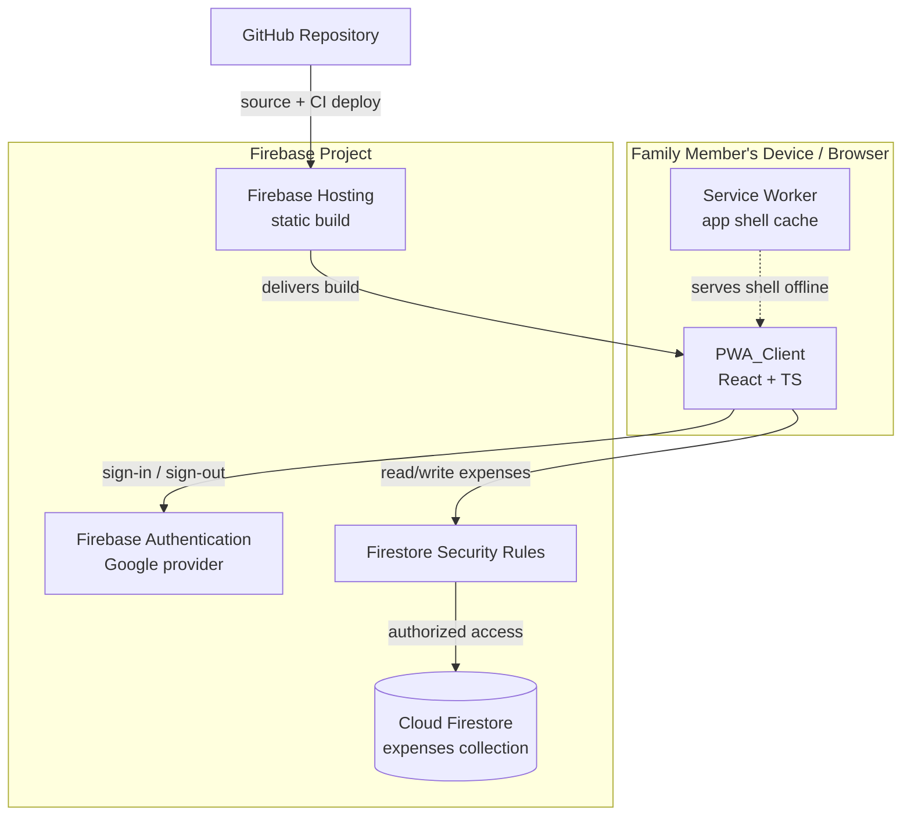

# Design Document

## Overview

The Family Expense Tracker is a Progressive Web App (PWA) built as a static client-side application backed by Firebase managed services. There is no custom server tier: the PWA_Client talks directly to Firebase Authentication (Google sign-in) and Cloud Firestore, with Firestore Security Rules enforcing access control on the server side. The app is deployed to Firebase Hosting via the Firebase CLI and its source is hosted on GitHub.

This design scopes the MVP defined in the requirements: authentication, expense entry, expense listing, a basic visualization dashboard, PWA installability/offline shell, access control, and a reproducible setup/deploy process.

### Design Goals

- **Thin, serverless architecture.** Lean on Firebase managed services so the MVP stays small and cheap to operate, matching the "basic MVP, iterate slowly" intent.
- **Server-enforced security.** Treat Firestore Security Rules as the source of truth for access control; the client UI gating is a usability layer, not a security boundary.
- **Pure, testable core logic.** Isolate validation and aggregation logic into pure functions so they can be unit- and property-tested independent of Firebase and the DOM.
- **Real-time by default.** Use Firestore real-time listeners so the expense list and dashboard update without manual reloads.

### Key Technology Decisions

| Concern | Decision | Rationale |
|---|---|---|
| Framework | React + Vite | Vite has first-class PWA tooling (`vite-plugin-pwa`), fast builds, and produces a static bundle Firebase Hosting can serve directly. |
| Language | TypeScript | Type safety on the Expense data model and validation logic reduces defects in the core logic that property tests target. |
| Backend | Firebase (Auth + Firestore) | Required by the spec; removes the need for a custom backend in the MVP. |
| Charts | Recharts | Declarative React charting; covers bar/pie visualizations for category, source, and month groupings. |
| Service worker / manifest | `vite-plugin-pwa` (Workbox) | Generates the manifest and a precaching service worker for the app shell with minimal config. |
| Property testing | fast-check | De-facto property-based testing library for the TypeScript/JS ecosystem; integrates with the chosen unit test runner. |
| Unit testing | Vitest | Native to the Vite toolchain; runs the same TS config as the app. |

> Research note: `vite-plugin-pwa` wraps Workbox to generate a Web App Manifest and a precaching service worker, and exposes registration lifecycle hooks (`onRegistered`, `onRegisterError`) that map directly to Requirement 5's registration and failure-handling criteria. Firebase Hosting serves a static SPA build and supports SPA rewrites in `firebase.json`, which is what Requirement 7 deployment expects. Firestore exposes `onSnapshot` real-time listeners, which satisfy the live-update criteria in Requirements 3, 4, and 6.

## Architecture

### System Context



### Application Layers

The PWA_Client is organized into four layers so that core logic stays free of framework and I/O concerns:

```mermaid
graph LR
    subgraph UI["UI Layer (React components)"]
        SignIn[SignIn]
        Entry[ExpenseEntryForm]
        List[ExpenseList]
        Dash[Dashboard]
        Shell[AppShell / Header]
    end

    subgraph State["State / Hooks Layer"]
        AuthCtx[AuthProvider]
        ExpHook[useExpenses]
    end

    subgraph Domain["Domain Layer (pure functions)"]
        Validate[validation.ts]
        Aggregate[aggregation.ts]
        Sort[sorting.ts]
        Map[expenseMapper.ts]
    end

    subgraph Data["Data Layer (Firebase adapters)"]
        AuthSvc[authService.ts]
        ExpRepo[expenseRepository.ts]
    end

    UI --> State
    State --> Domain
    State --> Data
    Data --> Domain
```



- **UI Layer** renders screens and forwards user intents. It holds no business rules beyond presentation.
- **State/Hooks Layer** mediates between UI and data: `AuthProvider` tracks the Session; `useExpenses` subscribes to the Firestore listener and exposes loading/error/data states.
- **Domain Layer** is pure TypeScript: validation, aggregation, sorting, and document/model mapping. This is the property-tested core.
- **Data Layer** wraps the Firebase SDK (auth flows, Firestore reads/writes and listeners). It is the only layer that imports the Firebase SDK.

### Routing and Session Gating

The client uses a single-page route table with a guarded boundary:

- `/signin` — public, renders `SignIn`.
- `/` (Dashboard), `/expenses` (list), `/add` (entry) — guarded. A `RequireAuth` wrapper checks the current Session; if absent it redirects to `/signin` (Req 1.7). Firebase Hosting is configured with an SPA rewrite so deep links resolve to `index.html`.

An idle-timeout timer (Req 1.10) and an auth-flow timeout (Req 1.8) live in the state layer and trigger sign-out + redirect.

## Components and Interfaces

### Data Layer

**authService.ts** — wraps Firebase Authentication.

```typescript
interface AuthService {
  // Begins Google sign-in (popup/redirect). Resolves on success, rejects on failure/cancel.
  signInWithGoogle(): Promise<FamilyMember>;
  signOut(): Promise<void>;
  // Subscribes to auth state; invoked with the member or null on every change.
  onAuthChanged(listener: (member: FamilyMember | null) => void): Unsubscribe;
  getCurrentMember(): FamilyMember | null;
}
```

**expenseRepository.ts** — wraps Firestore access for the `expenses` collection.

```typescript
interface ExpenseRepository {
  // Persists a new expense; sets recordedBy and createdAt server-side.
  addExpense(input: ExpenseInput, member: FamilyMember): Promise<string>; // returns doc id
  // Real-time subscription, ordered by date desc. Calls onData on every snapshot.
  subscribeToExpenses(
    onData: (expenses: Expense[]) => void,
    onError: (error: Error) => void
  ): Unsubscribe;
}
```

### State / Hooks Layer

**AuthProvider** exposes `{ member, status, signIn, signOut }` where `status ∈ { 'loading', 'authenticated', 'unauthenticated', 'error' }`. It owns the idle-timeout and auth-flow timeout timers and clears in-memory expense data on Session termination (Req 6.3).

**useExpenses** subscribes via `ExpenseRepository.subscribeToExpenses` while a Session is active and returns:

```typescript
interface UseExpensesResult {
  expenses: Expense[];        // already sorted date desc
  status: 'loading' | 'ready' | 'error';
  retry(): void;              // re-attempts subscription (Req 3.9, 4.7)
}
```

### Domain Layer (pure functions)

**validation.ts**

```typescript
function validateAmount(raw: string): Result<number, AmountError>;     // Req 2.2, 2.4
function validateDate(raw: string | null, today: Date): Result<Date, DateError>; // Req 2.7, 2.8
function validateDescription(raw: string): Result<string, DescError>;  // Req 2.1 (0..280)
function validateExpenseForm(form: ExpenseFormInput, today: Date): Result<ExpenseInput, FieldErrors>; // Req 2.5, 2.6
```

**aggregation.ts**

```typescript
function totalAmount(expenses: Expense[]): number;                 // Req 4.1
function groupByCategory(expenses: Expense[]): GroupTotal[];        // Req 4.2
function groupBySource(expenses: Expense[]): GroupTotal[];          // Req 4.3
function groupByMonth(expenses: Expense[]): GroupTotal[];           // Req 4.4 (YYYY-MM keys)
```

**sorting.ts**

```typescript
function sortByDateDdesc(expenses: Expense[]): Expense[];           // Req 3.4
```

**expenseMapper.ts**

```typescript
function toFirestore(input: ExpenseInput, member: FamilyMember): ExpenseDocument; // Req 2.3
function fromFirestore(id: string, doc: ExpenseDocument): Expense;                // Req 3.x
```

### UI Layer

| Component | Responsibility | Requirements |
|---|---|---|
| `SignIn` | Google sign-in button, error/timeout messages, signed-out landing | 1.1, 1.2, 1.4, 1.8, 1.9 |
| `AppShell` / `Header` | Display name/email/"Signed in"; sign-out control; offline banner | 1.5, 1.6, 5.6, 5.7 |
| `ExpenseEntryForm` | Amount/category/source/date/description fields, inline validation, confirmation, save error retention | 2.1–2.10 |
| `ExpenseList` | Ordered list, per-row fields, empty state, loading indicator, error + retry | 3.1–3.9 |
| `Dashboard` | Total + category/source/month charts, empty state, error + retry | 4.1–4.7 |
| `InstallPrompt` | Surfaces install affordance when `beforeinstallprompt` fires | 5.4 |

Categories and Sources are fixed enumerations in the MVP (no management UI). Sources include Cash, Credit Card, Reward Points, Food Coupon, and Cashback Points.

## Data Models

### Expense (client model)

```typescript
type Category =
  | 'Groceries' | 'Utilities' | 'Transport' | 'Dining'
  | 'Healthcare' | 'Entertainment' | 'Shopping' | 'Other';

type Source =
  | 'Cash' | 'Credit Card' | 'Reward Points'
  | 'Food Coupon' | 'Cashback Points';

// Validated input ready to persist (no id/audit fields yet).
interface ExpenseInput {
  amount: number;        // 0.01 .. 999999999.99, <= 2 decimals
  category: Category;
  source: Source;
  date: Date;            // 2000-01-01 .. today
  description: string;   // 0..280 chars (may be empty)
}

// Full client-side expense (read back from Firestore).
interface Expense extends ExpenseInput {
  id: string;
  recordedBy: string;    // FamilyMember uid
  createdAt: Date;       // creation timestamp
}
```

### ExpenseDocument (Firestore representation)

```typescript
interface ExpenseDocument {
  amount: number;            // stored as number (integer cents recommended; see note)
  category: string;
  source: string;
  date: Timestamp;           // Firestore Timestamp
  description: string;
  recordedBy: string;        // request.auth.uid
  createdAt: Timestamp;      // serverTimestamp()
}
```

> Amount precision note: to avoid binary floating-point rounding on sums, amounts are validated against the 2-decimal rule at the boundary and aggregation is performed in integer cents internally, converting back to a 2-decimal number for display. This keeps `totalAmount` exact for the value range in Req 2.2.

### FamilyMember

```typescript
interface FamilyMember {
  uid: string;
  displayName: string | null;
  email: string | null;
}
```

The display label resolves as `displayName ?? email ?? 'Signed in'` (Req 1.5).

### Firestore Collection Layout

```
expenses/{expenseId}
  amount, category, source, date, description, recordedBy, createdAt
```

A single shared `expenses` collection represents the family group in the MVP (no per-member partitioning, no group management — out of scope).

### GroupTotal (aggregation output)

```typescript
interface GroupTotal {
  key: string;     // category name, source name, or "YYYY-MM"
  total: number;   // sum of amounts for the group (2-decimal)
}
```

### Firestore Security Rules (model)

```
rules_version = '2';
service cloud.firestore {
  match /databases/{database}/documents {
    match /expenses/{expenseId} {
      allow read: if request.auth != null;
      allow create: if request.auth != null
                    && request.resource.data.recordedBy == request.auth.uid;
      // Update/delete excluded in MVP (editing/deleting out of scope).
      allow update, delete: if false;
    }
  }
}
```

This enforces Requirement 6: unauthenticated reads and writes are rejected with a permission error, and a created document must attribute itself to the authenticated caller.

## Correctness Properties

*A property is a characteristic or behavior that should hold true across all valid executions of a system-essentially, a formal statement about what the system should do. Properties serve as the bridge between human-readable specifications and machine-verifiable correctness guarantees.*

The domain layer of this app (validation, aggregation, sorting, and document mapping) is pure and input-driven, which makes it well suited to property-based testing. Authentication flows, Firestore reads/writes, security-rule enforcement, service-worker behavior, and deployment are tested with example-based, integration, smoke, or rules-emulator tests instead (see Testing Strategy), because they exercise external services and configuration rather than input-varying logic.

### Property 1: Signed-in label resolution

*For any* FamilyMember, the displayed identity label SHALL equal the display name when present, otherwise the email when present, otherwise the literal "Signed in".

**Validates: Requirements 1.5**

### Property 2: Amount validation accepts valid and rejects invalid amounts

*For any* amount input, `validateAmount` SHALL succeed if and only if the value is numeric, greater than or equal to 0.01, less than or equal to 999,999,999.99, and has at most 2 decimal places; all other amounts (non-numeric, below the minimum, above the maximum, or with more than 2 decimal places) SHALL be rejected.

**Validates: Requirements 2.2, 2.4**

### Property 3: Date validation defaults empty and rejects out-of-range dates

*For any* "current date" value, `validateDate` SHALL resolve an empty date input to the current date, SHALL accept any valid calendar date in the range 2000-01-01 through the current date, and SHALL reject any non-calendar date, any date earlier than 2000-01-01, and any date later than the current date.

**Validates: Requirements 2.7, 2.8**

### Property 4: Expense mapping round-trips and attributes the submitter

*For any* valid ExpenseInput and FamilyMember, mapping the input to a Firestore document and back SHALL preserve the user-entered fields (amount, category, source, date, description), and the Firestore document SHALL always include `recordedBy` equal to the member's uid and a creation timestamp.

**Validates: Requirements 2.3**

### Property 5: Expense list ordering

*For any* collection of Expenses, `sortByDateDesc` SHALL return a permutation of the input ordered by Expense date from most recent to least recent.

**Validates: Requirements 3.4**

### Property 6: Rendered expense row completeness

*For any* Expense, its rendered list row SHALL contain the monetary amount, the Category name, the Source name, and the Expense date; the description SHALL be shown when present and SHALL be blank when the description is empty.

**Validates: Requirements 3.2, 3.3**

### Property 7: Grand total equals the sum of amounts

*For any* collection of Expenses, `totalAmount` SHALL equal the exact sum of the amounts of all Expenses in the collection (computed in integer cents), and SHALL equal 0 for an empty collection.

**Validates: Requirements 4.1**

### Property 8: Grouping partitions the data

*For any* collection of Expenses and any grouping dimension (Category, Source, or calendar month), the produced groups SHALL have exactly one entry per distinct value present in the collection, and the sum of all group totals SHALL equal the grand total of the collection.

**Validates: Requirements 4.2, 4.3, 4.4**

## Error Handling

Errors are classified by source and handled at the layer closest to the cause, surfacing a user-facing message without losing user input or previously loaded data.

### Authentication errors

| Condition | Handling | Requirement |
|---|---|---|
| Google auth fails | Show sign-in error; remain on sign-in; no Session | 1.4 |
| Auth flow exceeds 60s | Cancel pending flow; show timeout error; return to sign-in; no Session | 1.8 |
| User cancels flow | Return to sign-in silently (no error) | 1.9 |
| Idle for 60 min | End Session; redirect to sign-in | 1.10 |

The state layer distinguishes "cancel" (no error UI) from "failure" (error UI) by inspecting the rejection reason from the Firebase Auth SDK.

### Expense write errors

- On `addExpense` rejection or no completion within 10 seconds, `ExpenseEntryForm` shows a save-failed error and **retains all entered field values** so the member can retry (Req 2.10). The 10-second ceiling is enforced with a timeout wrapper around the repository call.
- Validation failures are handled before any write: per-field messages are shown and no write is attempted (Req 2.4, 2.5, 2.6, 2.8).

### Expense read errors

- `useExpenses` exposes an `error` status on listener failure. `ExpenseList` and `Dashboard` show an error message, **retain previously displayed data**, and render a retry control that re-subscribes (Req 3.8, 3.9, 4.7).

### PWA / connectivity errors

- Service-worker registration failure is caught in the `vite-plugin-pwa` `onRegisterError` hook: the app continues from the network and shows an "offline capabilities unavailable" message (Req 5.3).
- Offline state (via the `offline`/`online` events) shows a "data requires a network connection" banner over the cached shell, removed on reconnect with a data reload (Req 5.6, 5.7).

### Security / access errors

- Firestore permission-denied responses for unauthenticated access are enforced by Security Rules (Req 6.1, 6.2). The client treats permission-denied on read as a load error and routes unauthenticated users to sign-in.

### Deployment errors

- Firebase Hosting releases are atomic: a failed `firebase deploy` leaves the prior release serving and prints the failure reason to the CLI (Req 7.3).

## Testing Strategy

The MVP uses a layered testing approach. Pure domain logic is covered by property-based tests (the bulk of correctness assurance) plus targeted unit tests for specific examples and edge cases. Firebase-dependent behavior is covered by mock-based unit tests and emulator/integration tests. Configuration is covered by smoke checks.

### Tooling

- **Vitest** as the test runner (shares the Vite/TS config).
- **fast-check** for property-based tests. Property-based testing is **not** implemented from scratch.
- **@testing-library/react** for component rendering tests.
- **Firebase Local Emulator Suite** for Firestore Security Rules tests.

### Property-based tests

- Each correctness property (1–8) is implemented as a **single** property-based test.
- Each property test runs a **minimum of 100 iterations**.
- Each property test is tagged with a comment referencing its design property in the format:
  `// Feature: family-expense-tracker-pwa, Property {number}: {property_text}`
- Generators:
  - **Amounts:** valid (0.01–999,999,999.99, ≤2 decimals) and invalid (negatives, zero, over-max, >2 decimals, non-numeric strings) arbitraries.
  - **Dates:** in-range, boundary (2000-01-01, today), out-of-range (pre-2000, future), and invalid calendar strings; with a generated "today" to keep tests deterministic.
  - **Expenses:** arbitrary category/source enums, amounts, dates, and descriptions including empty strings (to cover Req 3.3) and the 280-char boundary.
  - **Members:** all combinations of null/non-null displayName and email (to cover Req 1.5 fallback).

### Unit tests (examples and edge cases)

- Sign-in screen renders the Google option; sign-in click invokes the auth service (1.1, 1.2).
- Auth failure, cancel, timeout, idle-timeout behaviors with mocked auth service and **fake timers** (1.4, 1.8, 1.9, 1.10).
- Route guard redirects unauthenticated access (1.7) and clears state on sign-out (6.3).
- Missing-category and missing-source submissions are rejected (2.5, 2.6).
- Success confirmation + form clear (2.9); save-failure retains values (2.10).
- List empty state, loading indicator, read-error + retry (3.6, 3.7, 3.8, 3.9).
- Dashboard empty state and read-error + retry (4.6, 4.7).
- Install affordance on `beforeinstallprompt`; SW-registration-failure fallback message (5.4, 5.3).

### Integration tests

- Firestore listener flow with the emulator/mock: list and dashboard render from snapshots and update on new snapshots (3.1, 3.5, 4.5).
- Session establishment/teardown against the Auth mock (1.3, 1.6).
- Connectivity transitions: offline banner and reconnect reload (5.6, 5.7).

### Security rules tests (emulator)

- Unauthenticated read is denied; authenticated read is allowed (6.1).
- Unauthenticated create/update/delete is denied; authenticated create with matching `recordedBy` is allowed; update/delete denied for everyone in MVP (6.2).

### Smoke / configuration checks

- Generated manifest has name, icon sizes 192→512, and `display: standalone` (5.1).
- App shell is precached and renders (5.5).
- `firebase.json` / `.firebaserc` present with Hosting config (7.1); build produces a static `dist` (7.2).
- README contains ordered configure/run/deploy sections (7.4).
- `.gitignore` excludes Firebase credential and secret files; no secrets tracked (7.6).
